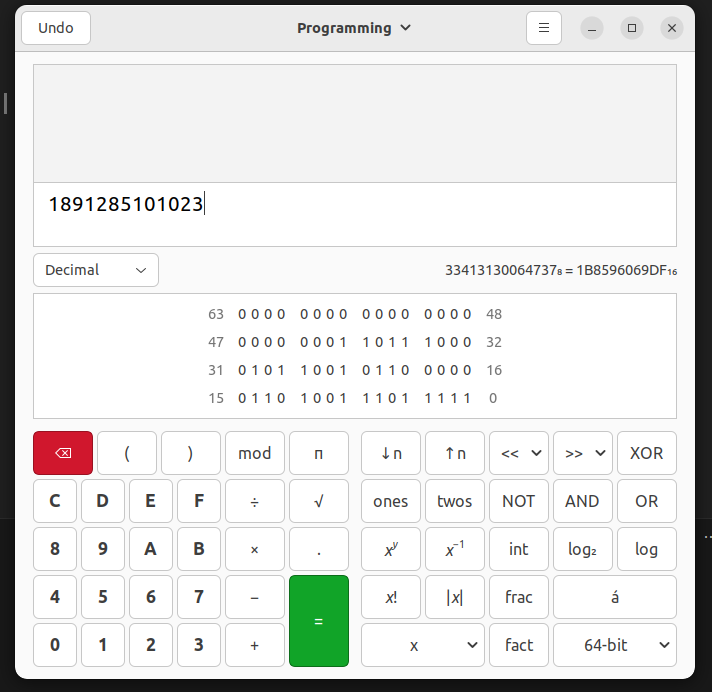
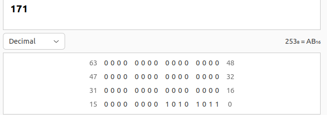
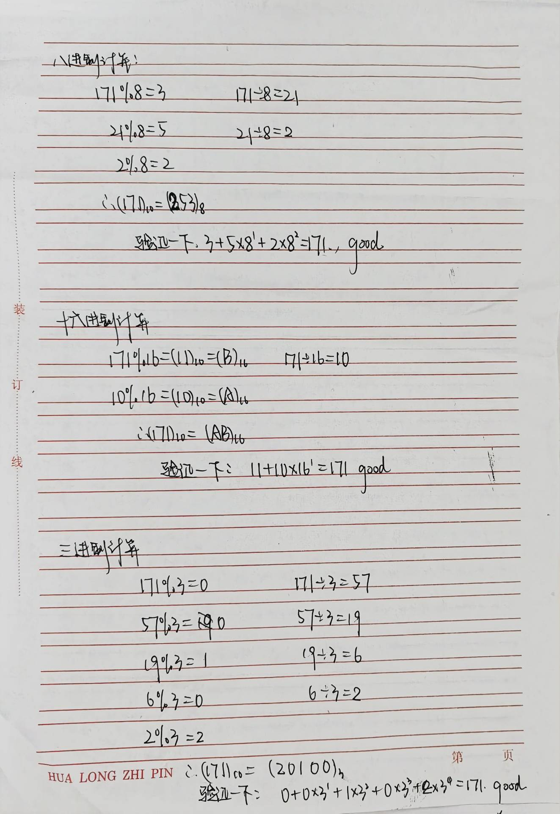

# 课堂派作业1
### 1.(1)证明：逻辑计算中只需要两个运算符，（非、与），或者（非、或）。

如果只有 NOT 和 OR，
根据De Morgan's law，我们可以得到:
$$A \lor B \equiv \neg (\neg A \land \neg B)$$

如果只有 NOT 和 AND，
同样根据De Morgan's law，我们可以得到:
$$A \land B \equiv \neg (\neg A \lor \neg B)$$

因此，在AND, NOT, OR三者之中，只需要二者{NOT, OR} 或 {NOT, AND} 就可以构建出与或非运算。

在数字电路设计中，与（AND）、或（OR） 和 非（NOT） 这三种基本逻辑运算可以用来构建任何其他逻辑门和电路。这是因为这三种运算是完备的（functionally complete），意味着可以组合它们来实现所有可能的逻辑功能。

### 1.(2)进一步思考，能否只用一个运算符？

可以，用NAND 或者 NOR。

比如，使用 NAND 门可以实现所有其他逻辑运算：

- **与（AND）**:
  $$A \land B \equiv \neg(A \operatorname{NAND} B)$$
  
- **或（OR）**:
  $$A \lor B \equiv \neg(\neg A \operatorname{NAND} \neg B)$$
  
- **非（NOT）**:
  $$\neg A \equiv A \operatorname{NAND} A$$


### 2.(1)把十进制数，1，891，285，101，023，转换为二进制数；

用计算器的Programming模式 敲进去看看：


再写一段简单的c代码 用shift操作输出各个bit：
```c
#include <bits/stdc++.h>
using namespace std;

signed main(){
    long long a = 1891285101023;
    
    cout << "bits of a: \n";
    for ( int i=63; i>=0; i-- ){
        cout << ((a>>i) & 1);
        if ( (i)%4 == 0 ) cout << ' ';
        if ( (i)%16 == 0 ) cout << '\n';
    }
}

/*
g++ bits.cpp -o bits && ./bits
*/

```

程序输出：
```shell
vincentzyu@vincentzyu:~/Documents/jmu-course/jmu-basic/homework$ g++ bits.cpp -o bits && ./bits
bits of a: 
0000 0000 0000 0000 
0000 0001 1011 1000 
0101 1001 0110 0000 
0110 1001 1101 1111 
vincentzyu@vincentzyu:~/Documents/jmu-course/jmu-basic/homework$ 
```

very good， 和计算器的结果一样

### 2.(2)把二进制数，1010 1011分别转换为十进制、八进制、十六进制和三进制数。

  
 
先写出十进制数值，
方法：如果某个位置是1,那么结果就加上这个位置的weight（weight是2^k, k是从低位往高位数的位数
**Decimal value** = 1+2+8+32+128 = 171  

然后 如果想要获得t进制的数，就做一个循环：依次取模t，然后处以t，就得到t进制的这个数。

过程如下：
