## 实验 3：Linux 文件系统管理

### 4、实验过程
#### (1)目录操作  
在当前目录下创建一个子目录，对其进行相应，然后再删除它（要求每步都要使用 ls
命令观察结果）：  
- a. 创建目录：mkdir dir1 dir2  
- b. 复制文件或目录：cp -r /etc/rc.d dir1  
- c. 复制文件或目录：cp -r /etc/rc.d dir3  

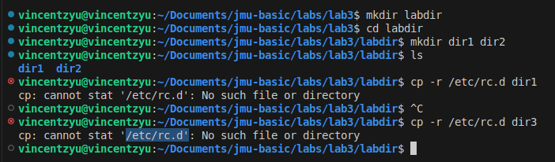

好像没找到/etc/rc.d文件, 搜一搜资料看一下：

> gpt的回答：  
>> 许多现代 Linux 发行版使用 systemd 作为初始化系统（init system），从而取代了传统的 /etc/rc.d 和基于运行级别的服务管理方式。这意味着在 systemd 系统上，服务和启动脚本都由 systemctl 和对应的 /etc/systemd/ 目录进行管理。

那就换一个路径：
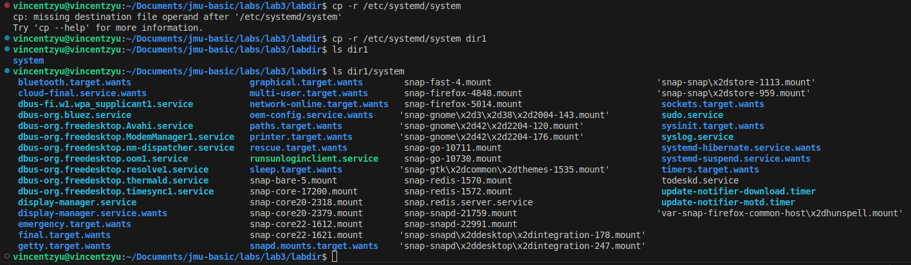
66, 好像用-r参数 可以把文件夹里面的子文件全部复制

那如果试试看不带参数复制文件夹呢？
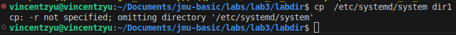
好像确实不可以

d. 删除目录（方法 1）  ：rmdir dir1 dir2  
e. 删除目录（方法 2）  ：rm –rf dir1  

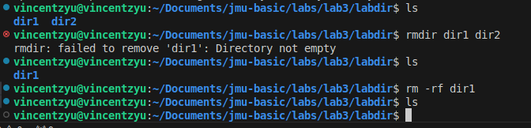


f. 观察 dir3 的内容后，删除之。  

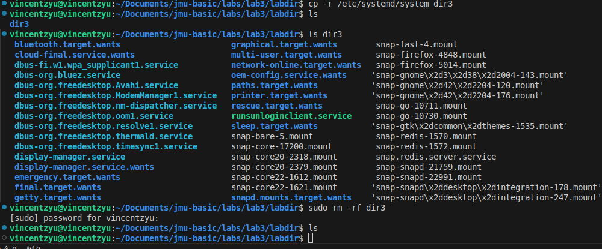


#### (2)文件的硬链接与符号链接 

创建一个文件myfile 和一个目录mydir，
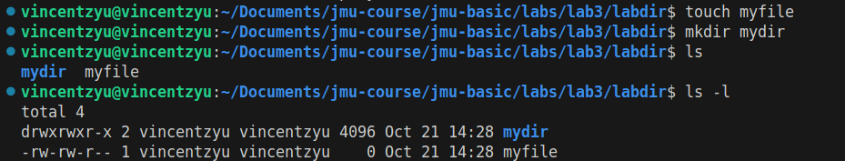
分别为myfile 创建一个硬链接和一个符号链接：  
```bash   
ln  myfile  /tmp/myfile  
ln  -s  myfile  /tmp/myfile1    
ln  -s  mydir  /tmp/myd   
```
使用ls 命令查看结果。   

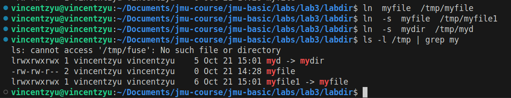

<u><span style="color:lightblue;">对了，ln指令是干什么的？ 用tldr看看：</span></u>


> ```shell
> vincentzyu@vincentzyu:~/Documents/jmu-course/jmu-basic/labs/lab3/> labdir$ tldr ln
> ln
> Create links to files and directories.More information: https://www.gnu.org/software/coreutils/ln.
> 
>  - Create a symbolic link to a file or directory:
>    ln -s {{/path/to/file_or_directory}} {{path/to/symlink}}
> 
>  - Overwrite an existing symbolic link to point to a different file:
>    ln -sf {{/path/to/new_file}} {{path/to/symlink}}
> 
>  - Create a hard link to a file:
>    ln {{/path/to/file}} {{path/to/hardlink}}
> 
> ```

再问问gpt

```md
1. ln file1 file2

    功能：创建一个硬链接。
    说明：
        file1 是源文件（被链接的文件）。
        file2 是硬链接的名称。
        硬链接是指向文件内容的直接指针，file2 将与 file1 指向同一个文件数据。
        如果 file1 被删除，file2 仍然可以访问文件的内容。
        硬链接不能跨文件系统（不同的分区），且不能链接目录（除非使用超级用户权限）。

2. ln -s file1 file2

    功能：创建一个符号链接（软链接）。
    说明：
        -s 选项表示创建符号链接。
        file1 是源文件（被链接的文件）。
        file2 是符号链接的名称。
        符号链接是指向文件路径的快捷方式，它并不直接指向文件内容，而是包含了对 file1 的路径。
        如果 file1 被删除，file2 将变成一个无效链接（断开的链接），因为它指向的路径不再存在。
        符号链接可以跨文件系统，并且可以链接目录。

3. ln -s dir1 dir2

    功能：创建一个指向目录的符号链接。
    说明：
        -s 选项表示创建符号链接。
        dir1 是源目录（被链接的目录）。
        dir2 是符号链接的名称。
        dir2 将成为 dir1 的快捷方式，通过访问 dir2 可以访问 dir1 目录的内容。
        同样，如果 dir1 被删除，dir2 将变成无效链接。

总结

    ln file1 file2：创建一个硬链接 file2 指向文件 file1，两者共享同一文件内容。
    ln -s file1 file2：创建一个符号链接 file2 指向 file1 的路径，file2 是 file1 的快捷方式。
    ln -s dir1 dir2：创建一个符号链接 dir2 指向目录 dir1，dir2 是 dir1 的快捷方式。
```
 
soga, 这么神奇的？ 操作一下试试：

```bash
sudo vim /tmp/myfile
```

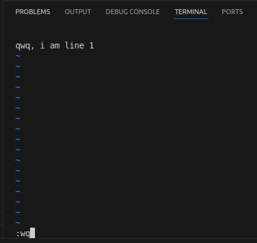

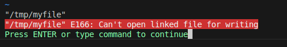  

<u><span style="color:lightblue;">诶？用vim的话  好像不能用这个硬链接来写文件？</span></u>


用echo+重定向试试看：
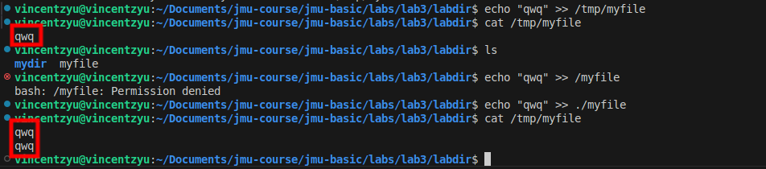
可以！
可见，我刚刚使用了两次echo+重定向，来往文件里输入内容，
输入的内容都是qwq
而第一次的重定向路径参数是指针名`/tmp/myfile`
第二次用的是被链接文件的路径`./myfile`

然后两次都使用`cat /tmp/myfile` 来查看文件内容，发现两次的echo都成功往文件里输入内容

接着再把源文件.myfile删了，然后试试看/tmp/myfile能不能访问到这个文件呢？  
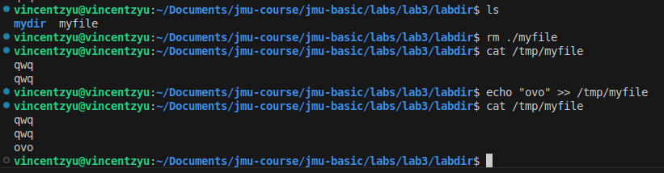
还真可以！  

to be honest, `ln file1 file2` 然后file1删了，file2仍然能够访问到这个文件，第一次听上去 会比较反直觉， 于是我就去问gpt：

我的提问：
```
ln file1 file2

第一次看到这个用法的时候会有点反直觉，因此引人思考：

文件实际上存储在别处，在物理内存中不一定按照文件树 的逻辑存储， 但是文件树把不同地方的内存组织起来？

一旦使用ln file1 file2， 那么file1 file2将指向同一个内存对应的文件？

我说的对吗 有需要纠正的吗
```  


gpt的回答：
```
你说得很对，关于硬链接和文件存储的理解非常深入。让我稍微整理和补充一下你的理解：
硬链接和文件存储

    文件存储和物理地址：
        文件在磁盘上以数据块的形式存储，而不是简单地按照文件名的逻辑顺序存储。文件系统使用 inode（索引节点）来管理文件的元数据（如文件大小、创建时间、权限等）和数据块的物理地址。
        每个文件在文件系统中都有一个唯一的 inode。inode 存储了指向文件数据块的指针。

    硬链接的机制：
        当你执行 ln file1 file2 时，实际上是创建了一个新的目录项（file2），这个目录项指向同一个 inode，即相同的文件数据。换句话说，file1 和 file2 都指向同一个物理文件内容。
        这就是为什么删除 file1 后，file2 仍然可以访问文件内容的原因。只有在所有硬链接都被删除后，文件数据才会被真正从磁盘中清除。

    文件树与逻辑结构：
        文件树（目录结构）是一种逻辑组织方式，用于帮助用户和操作系统管理文件。它通过目录和文件名的关系建立起文件的层次结构。
        硬链接使得同一个文件可以通过不同的路径（不同的文件名）访问，这种方式在逻辑上可能会引起混淆，因为看起来有多个文件，但实际上它们都指向同一个物理内容。

总结

你的理解是准确的，ln file1 file2 使得 file1 和 file2 都指向同一个 inode，这两个文件名只是逻辑上的别名，背后却是同样的数据存储在磁盘上。这种特性在文件管理和节省存储空间方面非常有用。
```

<br>

接下来，再去看看 符号链接/tmp/myfile1
刚刚把myfile删了， 先创建回来，然后检查一下链接：
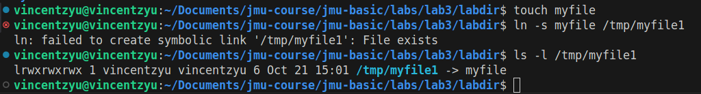
 
然后分别对源文件和符号链接进行echo重定向：
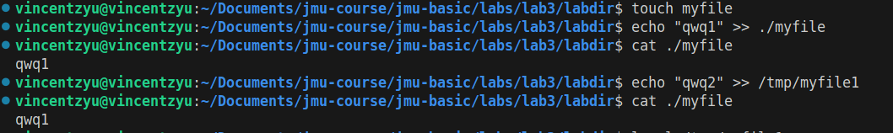

耶？ 好像对/tmp/myfile1这个符号链接的echo重定向不管用？？

检查一下权限 再试试？  
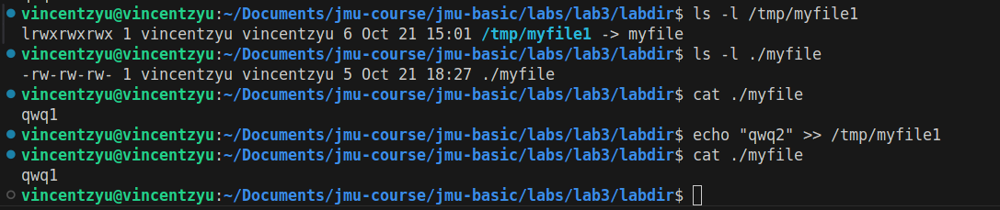
好像还是不行？

那试试看： 先把现在的符号链接删了，然后重新创建，但这次改用绝对路径：  
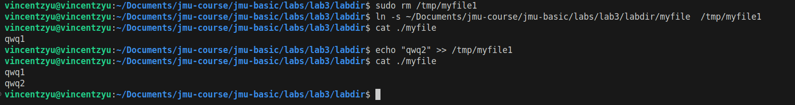

ok，这次可以了， 可见，对于源文件`./myfile`和符号链接`/tmp/myfile1`, echo指令都是可以进行重定向的

<br>

接着再试试 对于文件夹的符号链接：
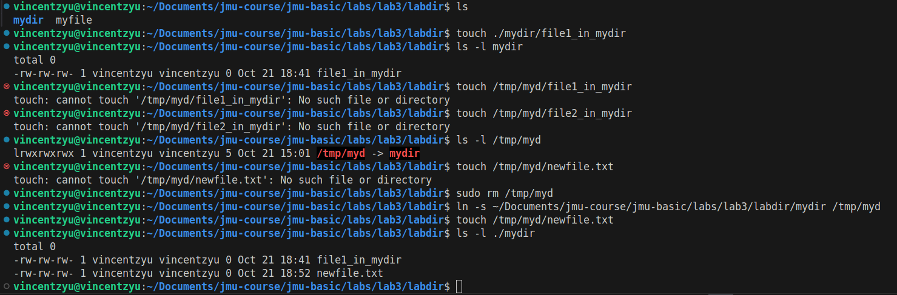

还是类似的，刚开始我用/tmp/myd这个符号链接作为路径的一部分，然后好像找不到这个文件


<u><span style="color:lightblue;">后面我把符号链接删了 改成绝对路径就好使了，见上图↑</span></u>


最后再附上一张 老师上课讲ln指令的时候，我在下面顺手实操的过程：
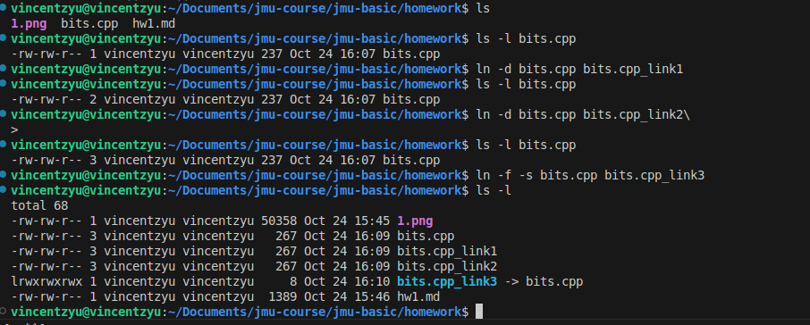
 

#### (3)文件查找  
说明：如果查找的文件不存在，可以事先创建之，以供实验之用。   
##### a. 在目录/tmp 和/home 下查找24 小时内没有更改的文件。   
```bash
find /tmp /home –mtime –1 –print  
```

<br>
... 这个指令好像输出的东西有亿点多:   


<br>
换一个路径试试：  

```bash
vincentzyu@vincentzyu:~/Documents/jmu-course$ find ./ -mtime -1 -print
```

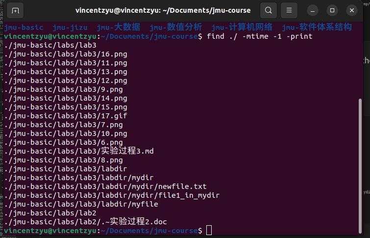

ovo， PDF里面的文字好像写反了，这个指令后面三个参数的意思好像是 输出24小时内被更改过的文件， 问题不大

##### b. 在/home 下查找属于用户gjshao 的c 语言程序文件。  
```bash
find  /home  –user  gjshao  –name  ”*.c”  –print  
```

看来find这个工具能指定的参数挺多的，修改一下参数：
在/home/vincentzyu/Documents/jmu-course 下查找属于用户vincentzyu 的markdown文件。  

```bash
find /home/vincentzyu/Documents/jmu-course -user vincentzyu -name "*.md" -print

find /home/vincentzyu/Documents/playfield-learning -user vincentzyu -name "*.md" -print
```

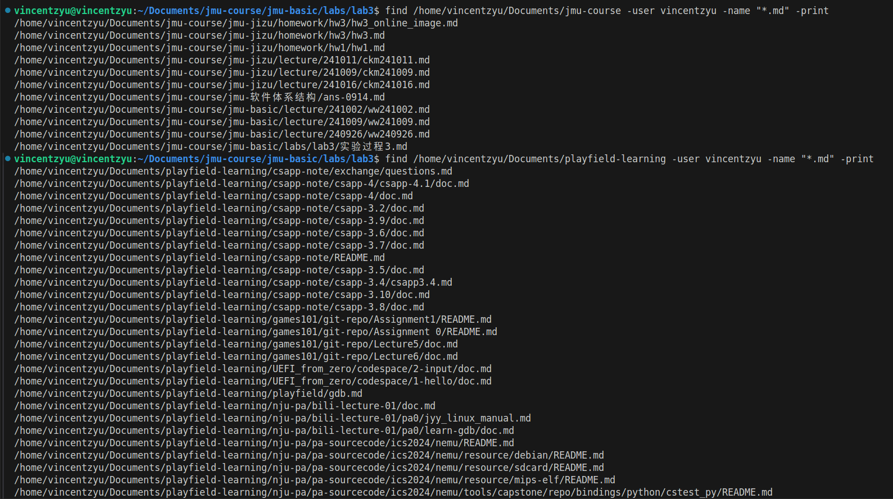


##### c. 将当前目录内的所有*.c 和*.h 的文件打成tar 包/tmp/mych.tar 
```bash
tar cvf ./images.tar `find ~/Documents/jmu-course -name "*.png" -type f`
```

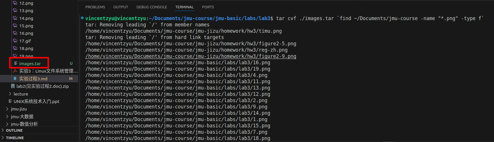


我再修改一下参数：

```bash
tar -cvf images.tar ~/Documents/jmu-course/*.png
```

把~/Documents/jmu-course目录下的所有png文件打成tar，名字叫做images.tar


##### d. 在/tmp 目录内查找文件*.tmp，然后删除之 
find  /tmp –name ”*.tmp”  -exec rm {} \; 

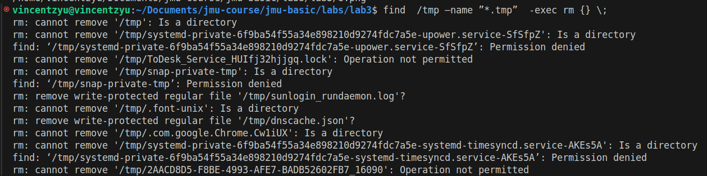

<u><span style="color:lightblue;">问一下gpt，对于各个参数的解释:</span></u> 
<br>
<u><span style="color:lightblue;">-name 指定文件名，可以用正则表达式匹配</span></u>
<br>
<u><span style="color:lightblue;">-exec 对于找出来的每个文件的操作</span></u>

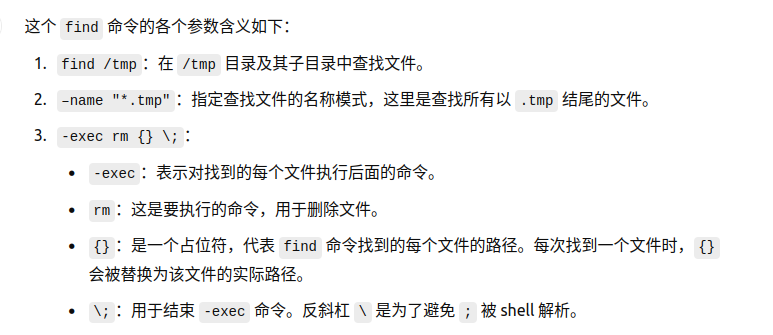

#### (4)使用fdisk 命令观察硬盘分区   
##### a. fdisk –l

部分输出节选：
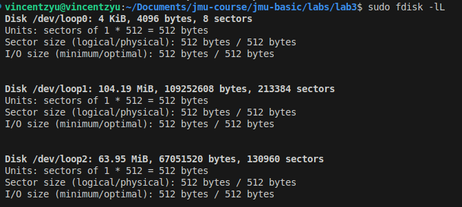

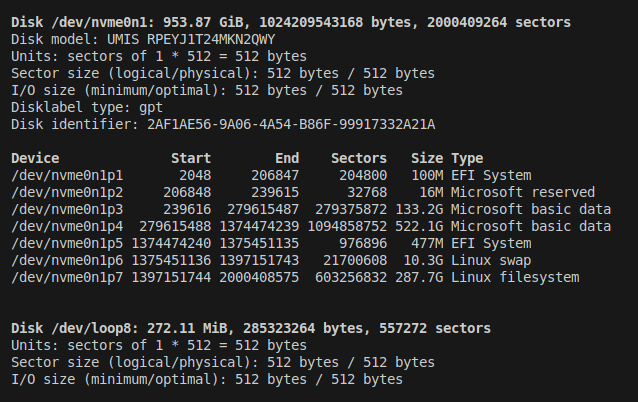

然后找gpt 简单说明一下 这些分区的用途：
```
Loop 设备

这些 /dev/loopX 设备是环回设备，通常用于挂载镜像文件（如 ISO 文件）或用于创建临时文件系统。在这个输出中，你有多个环回设备，它们的大小和用途可能不同，但通常这些设备不代表物理硬盘上的分区，而是由系统自动创建的。具体用途需要根据你系统中挂载的内容来确定。
NVMe 设备

/dev/nvme0n1 是你的 NVMe 固态硬盘（SSD），它的分区情况如下：

    /dev/nvme0n1p1:
        大小: 100 MB
        类型: EFI System
        用途: 存放 UEFI 启动文件，系统启动时需要读取的文件。

    /dev/nvme0n1p2:
        大小: 16 MB
        类型: Microsoft reserved
        用途: Windows 系统保留分区，通常用于系统恢复或动态磁盘管理。

    /dev/nvme0n1p3:
        大小: 133.2 GB
        类型: Microsoft basic data
        用途: 存放 Windows 操作系统及其数据的主要分区。

    /dev/nvme0n1p4:
        大小: 522.1 GB
        类型: Microsoft basic data
        用途: 另一个用于 Windows 操作系统或数据存储的分区。

    /dev/nvme0n1p5:
        大小: 477 MB
        类型: EFI System
        用途: 可能是另一个启动分区，通常用于多重启动或存放其他操作系统的启动文件。

    /dev/nvme0n1p6:
        大小: 10.3 GB
        类型: Linux swap
        用途: 交换分区，用于 Linux 系统的虚拟内存管理。

    /dev/nvme0n1p7:
        大小: 287.7 GB
        类型: Linux filesystem
        用途: 存放 Linux 操作系统及其数据的主要分区。

总结

    Loop 设备: 用于临时挂载文件或文件系统。
    NVMe 设备: 包含 Windows 和 Linux 系统的分区，其中包括启动分区、数据分区和交换分区。
```

##### b. 进入fdisk 命令界面：fdisk /dev/sda 
使用 fdisk 的 m 命令进行帮助；使用 l 命令观察常见分区的类型；使用 p 命令观察
/dev/sda 上分区；使用q 命令退出fdisk；其它命令要慎重（建议不试）。

我进了 linux文件系统分区：
```bash
vincentzyu@vincentzyu:~/Documents/jmu-course/jmu-basic/labs/lab3$ sudo fdisk /dev/nvme0n1p7

Welcome to fdisk (util-linux 2.37.2).
Changes will remain in memory only, until you decide to write them.
Be careful before using the write command.

This disk is currently in use - repartitioning is probably a bad idea.
It's recommended to umount all file systems, and swapoff all swap
partitions on this disk.

The device contains 'ext4' signature and it will be removed by a write command. See fdisk(8) man page and --wipe option for more details.

Device does not contain a recognized partition table.
Created a new DOS disklabel with disk identifier 0x526ef30f.

Command (m for help): p
Disk /dev/nvme0n1p7: 287.66 GiB, 308867497984 bytes, 603256832 sectors
Units: sectors of 1 * 512 = 512 bytes
Sector size (logical/physical): 512 bytes / 512 bytes
I/O size (minimum/optimal): 512 bytes / 512 bytes
Disklabel type: dos
Disk identifier: 0x526ef30f

Command (m for help): q

vincentzyu@vincentzyu:~/Documents/jmu-course/jmu-basic/labs/lab3$ 
```


#### (5)外来文件系统的使用 
以U-盘为例，实验Linux 系统中文件系统或存储设备的使用方法   
将Linux 作为当前活动任务（相对于Windows 系统）；插入U 盘后，稍候；

使用命令`fdisk –l`察看U盘所使用的设备（可能要运行fdisk –l多次），设U盘设备为/dev/sdb1，试完成以下操作：   
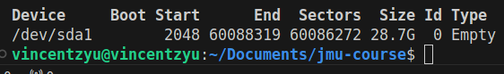

这好像格式化以后没指定分区？
用mkfs格式化成FAT32试试看
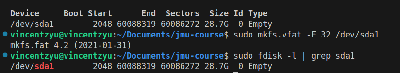  
。。。 好像type还是显示的Empty？？

用`lsblk -f`看看：
```bash
vincentzyu@vincentzyu:~/Documents/jmu-course$ sudo lsblk -f
NAME FSTYPE FSVER LABEL UUID                                 FSAVAIL FSUSE% MOUNTPOINTS
......
sda                                                                         
└─sda1
     vfat   FAT32       E3A7-C51F    
```  

qwq还是进windows看看？   
重启，然后进grub命令行，重新引导一下：  
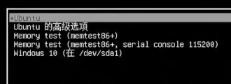
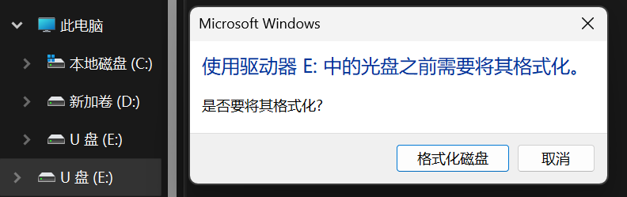  


好像能识别出来诶，格式化试试  
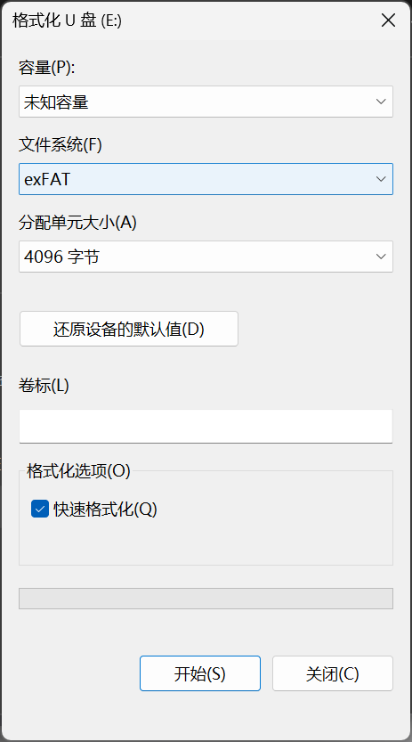  

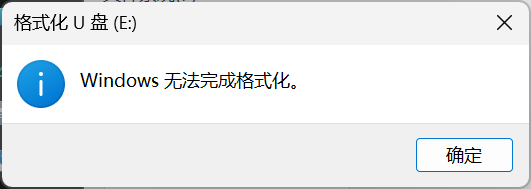  
  
。。。难崩，u盘不会坏了吧

网上搜搜还有没有办法，  

[Windows无法格式化U盘怎么办？5种解决方法！(https://www.disktool.cn/content-center/cant-format-flash-drive-6540.html)](https://www.disktool.cn/content-center/cant-format-flash-drive-6540.html)

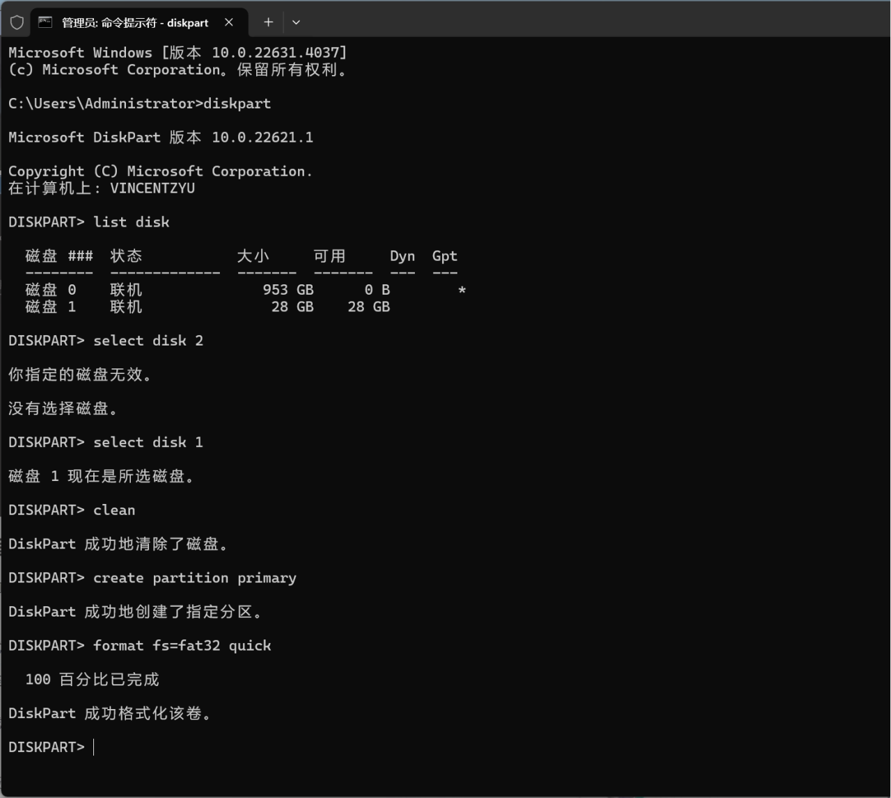

好好好，看起来好像格式化成功了，现在linux和windows都可以读了
这个FAT32格式 好像都能读：

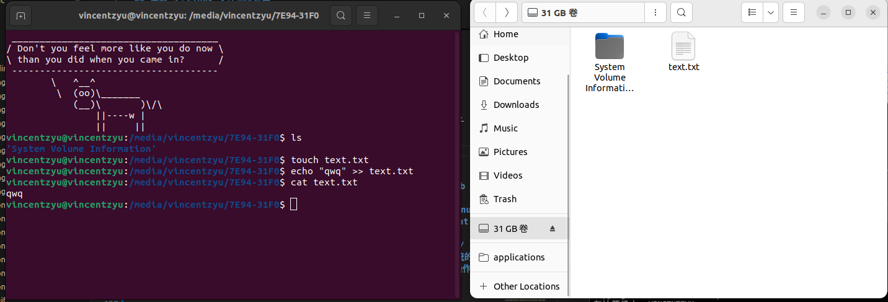

然后用`fdisk -l` + 管道 + `grep` 看看u盘：
```bash
sudo fdisk -l | grep -E 'Device|FAT32'
```
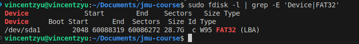

##### a. 构造U 盘的映像。
方法：cp /dev/sdb  U_img 或 dd if=/dev/sdb of=U_img bs=36b  

用一下dd，将 /dev/sda1 分区中的数据以二进制流的形式复制到 U_img 文件中
```bash
sudo dd if=/dev/sda1 of=U_img bs=36b
sudo dd if=/dev/sda1 of=U_img bs=36b status=progress
```
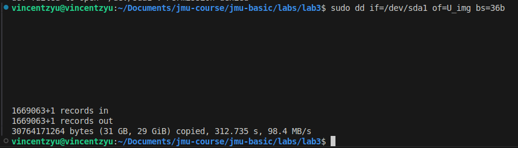
这个语句执行了五分多钟，尽管速度接近100 Million Byte per second

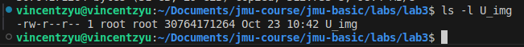

##### b. U 盘的使用。
方法：`mount /dev/sdb1  /mnt`（安装）；  
使用(可将Linux 系统的某个文件目录复制到U 盘：`cp S9*  /mnt`)；  
`umount /dev/sdb1` 或 `umount /mnt`（拆卸）；  

先在linux图形界面看看结果：
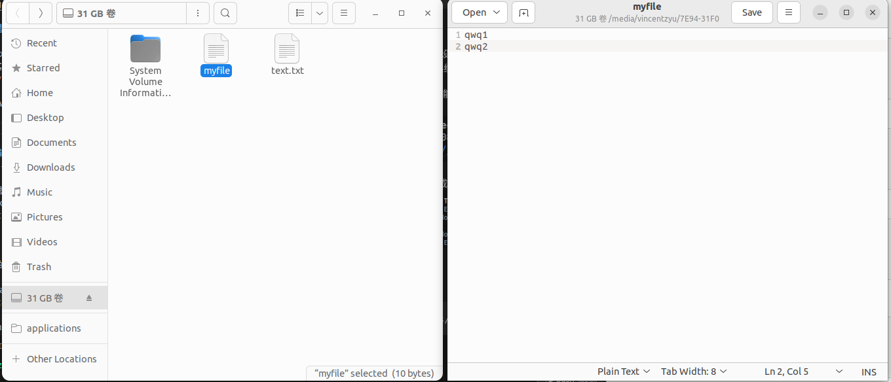


btw，好像这个u盘支持自动挂载，在media路径下可以找到：
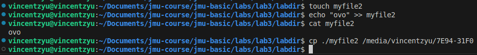

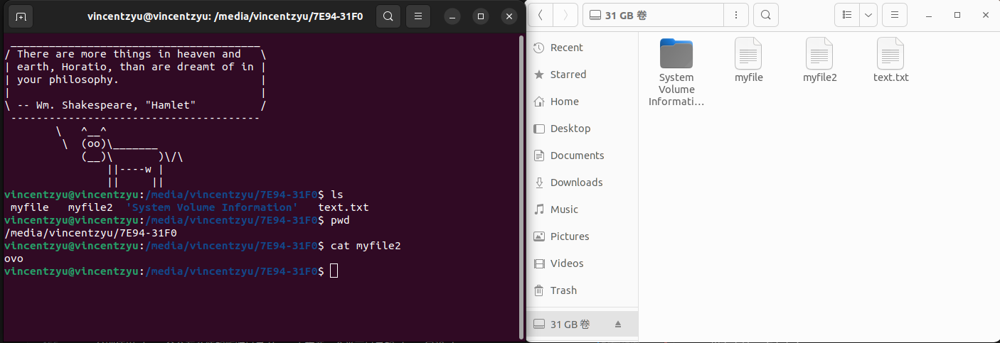

然后再在Windows 系统下观察刚才的操作结果。

##### c. 映像的使用（使用步骤 a 的结果）。
方法：mount  –o  loop  /dev/U_img  /mnt（安装）；
使用(可将 U 盘映像 U_img 中的内容复制到 Linux 系统的当前目录：cp  /mnt/某些文件 .)；
umount  /mnt（拆卸）；然后再用ls 命令查看操作的结果。 

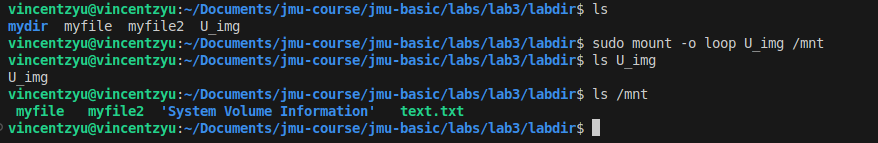

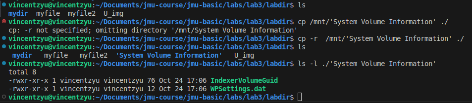

好像发现了一个`System Volume Information`目录，，简单问问GPT这大概是干啥的：

```md
`System Volume Information` 文件夹主要是 Windows 系统用来存储与系统恢复、卷管理和文件索引相关的元数据。在 Linux 系统中，这个文件夹及其内容对于访问 U 盘的文件并没有实际的帮助，具体原因如下：

### 1. **Windows 专用**
- `System Volume Information` 文件夹及其中的文件是专门为 Windows 操作系统设计的，用于管理和优化文件系统的功能（如系统还原点和卷索引）。
- Linux 系统并不使用这些功能，因此这些文件对 Linux 用户来说没有直接的价值。

### 2. **影响访问文件**
- 访问 U 盘上的普通文件和目录时，Linux 可以直接读取和写入 U 盘中的文件，与 `System Volume Information` 的存在无关。
- 如果你在 Linux 中挂载 U 盘，通常你会看到 U 盘的根目录和文件，而 `System Volume Information` 目录不会影响对其他文件的访问。

### 3. **可能的存储空间占用**
- 虽然 `System Volume Information` 文件夹中的文件不会影响 Linux 对 U 盘的访问，但如果 U 盘中存储了大量的系统信息文件，这可能会占用一部分存储空间。
- 如果你打算在 Linux 系统中管理 U 盘上的空间，可能会希望了解和管理这些系统文件，但对于日常使用和文件访问来说，通常可以忽略它们。

### 总结
总之，`System Volume Information` 文件夹对于 Linux 访问 U 盘文件没有直接的帮助。你可以在 Linux 中正常使用 U 盘进行文件操作，而无需考虑这个目录的存在。
```

最后umount
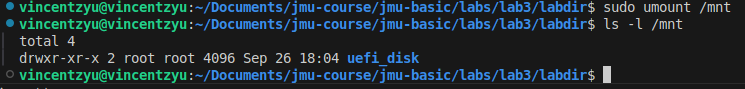  

umount以后，之前的几个文件没了，取而代之的是一个空的uefi_disk文件夹，好像是之前配置UEFI开发环境留下的。 为什么？我去问一下GPT：

```
1. 卸载文件系统的影响

    当你使用 umount 命令卸载文件系统（在你的例子中是 U 盘）时，系统会断开与该文件系统的连接。此时，任何挂载在该目录下的文件和子目录将不再可见。
    卸载后，原来挂载的内容（例如 U 盘中的文件）会消失，取而代之的是挂载点目录本身，即 uefi_disk 这个文件夹。这个文件夹是在你之前挂载 U 盘时创建的，仍然保留在 /mnt 目录中。

2. 挂载点的作用

    在 Linux 中，挂载点是一个目录，允许访问某个文件系统的内容。挂载文件系统后，该目录下的内容会变成所挂载文件系统的内容。
    卸载后，挂载点仍然存在，但它的内容不再是原先挂载的文件系统中的内容。
```

#### (6) tar 命令的使用与tarball 的构造，文件的压缩与解压缩 
##### a. 分别使用 tar 命令在系统的临时目录/tmp 下构造一个当前目录的 tar 包和 tar压缩包。
方法： 
`tar  cvf  /tmp/mytar  *`
`tar  cvfz  /tmp/mytar.tgz  *` 

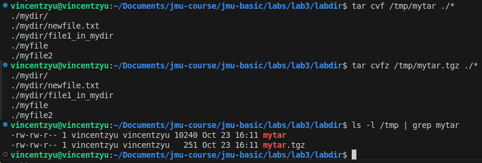

- 参数用法
    - c：创建一个新的归档文件。
    - v：显示详细信息（显示归档过程中正在处理的文件）。
    - f + path/to/tar：指定生成的 tar 的路径和名称为 /path/to/tar。
    - z：在打包的同时对归档文件进行 gzip 压缩，生成 .tgz 或 .tar.gz 格式的文件。
    - *：将当前目录下的所有文件和子目录打包并压缩。

##### b. 察看tar 包的内容。
方法： 
`tar tvf /tmp/mytar`  
`tar tvfz /tmp/mytar.tgz`  

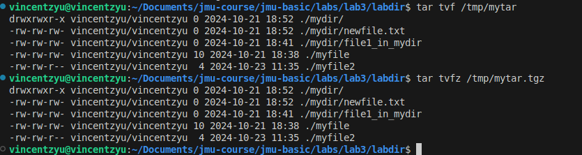

- 参数用法
    - t：列出归档文件中的内容。
    - v：详细模式，显示详细信息。
    - f + path：指定要操作的归档文件， path是归档文件的路径。
    - z：表示归档文件是用 gzip 压缩的，所以在读取内容时需要解压（解压 .tgz、.gz 格式的归档文件）。

##### c. 展开或解压缩tar 包的内容。
方法：  tar xvf /tmp/mytar    或  tar xvf /tmp/mytar 文件名  
tar xvfz /tmp/mytar.tgz  或  tar xvfz /tmp/mytar.tgz 文件名 

##### d. 使用bzip2 的tar 包压缩：  
参照教材。 

bzip2用法：
```bash
tar cvfj /path/to/archive.tar.bz2 /path/to/files
```
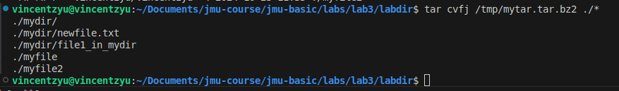  


```bash
tar tvfj /tmp/mytar.tar.bz2
```
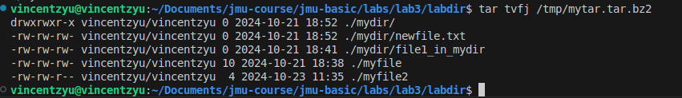  

##### e. 使用7z进行压缩

除此之外，我比较喜欢用的一个开源软件: 7z

```bash
7z a /tmp/archive.7z ./*
7z l /tmp/archive.7z
```
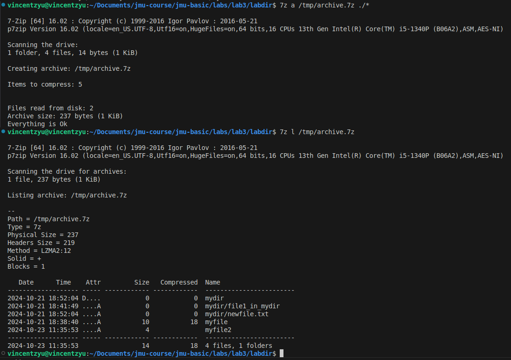

#### (7)Linux 系统文件和文件系统管理的图形界面 
要求在图形界面下：查看Linux 系统的根目录结构并做出记录，说明每个目录及重要
其子目录的作用（比方说/dev，/etc，/dev，/mnt，/usr，/home，等）。

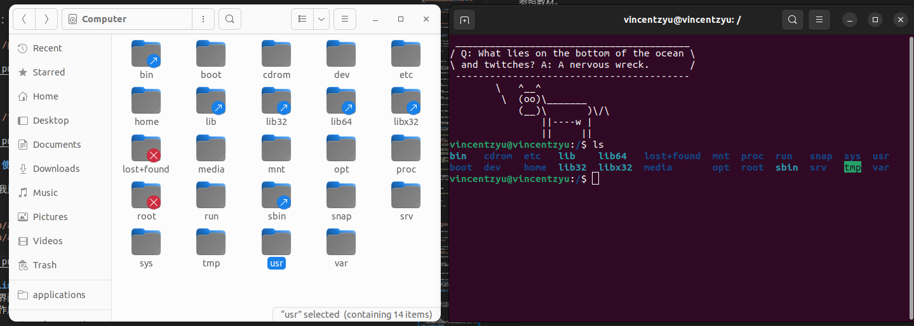

问问gpt，这些文件夹主要是做什么的：

```
bin: 这个目录包含了用户和系统级别的基本命令和工具，比如 ls、cp、mv 等。

boot: 包含启动时需要的文件，如内核文件和启动加载程序（boot loader）。

dev: 这个目录包含设备文件，它们代表系统中的硬件设备，如硬盘、终端等。

etc: 这个目录包含系统配置文件。大多数应用程序和系统服务的配置文件都存储在这里。

home: 每个用户的主目录都在这个目录下，通常以用户的用户名命名。例如，用户 vincentzyu 的主目录为 /home/vincentzyu。

lib: 包含系统和应用程序需要的共享库文件，这些文件是可执行文件运行时所需的。

lib32: 在 64 位系统中，包含 32 位库文件，以支持运行 32 位应用程序。

lib64: 包含 64 位库文件，用于支持运行 64 位应用程序。

lost+found: 用于文件系统检查和恢复丢失的文件。在发生文件系统错误时，恢复的文件将被放置在这里。

mnt: 这个目录通常用于临时挂载文件系统，例如外部硬盘、U 盘等。

media: 这个目录用于自动挂载可移动媒体设备，如 USB 驱动器和 CD-ROM。

opt: 用于安装附加的、可选的软件包和应用程序。

proc: 虚拟文件系统，提供关于系统和进程的信息。文件中包含的内容反映了内存中的状态。

run: 存放运行时数据的目录，例如服务的 PID 文件和 socket 文件。

sbin: 这个目录包含系统管理命令，通常需要超级用户权限来执行。

srv: 用于存放由系统提供的服务的数据，比如 web 服务器的文件。

sys: 另一个虚拟文件系统，提供关于内核和设备的实时信息。

tmp: 存放临时文件的目录，通常会在系统重启时被清空。

usr: 包含用户级别的应用程序和文件。这个目录下通常有 bin、lib 和 share 等子目录，存放用户级程序和库文件。

var: 这个目录包含经常变化的文件，如日志文件、邮件和临时文件。
```


找到了一篇参考资料：
[linux文件系统（https://www.runoob.com/linux/linux-system-contents.html）](https://www.runoob.com/linux/linux-system-contents.html)

> -----  
> linux文件树结构：：
> 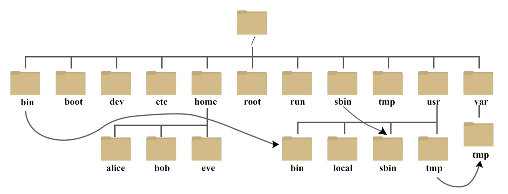
>
> ----- 

<br><br>
-----
7z打包：
```
7z a lab3.zip lab3 -x\!'lab3/labdir/U_img'
```