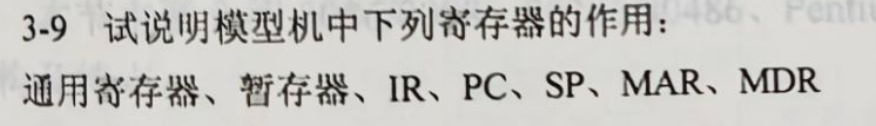

# 教材习题3

## 3-9说明模型机中下列寄存器的作用: 通用寄存器、暂存器、IR、PC、SP、MAR、MDR

 有关寄存器，我翻到了这本80386手册， 我觉得讲的挺清楚的：
 [https://pdos.csail.mit.edu/6.828/2018/readings/i386.pdf](https://pdos.csail.mit.edu/6.828/2018/readings/i386.pdf)

接下来 我对这本书的`2.3 Registers`这一部分 进行翻译:

### 2.3 Registers 寄存器

> The 80386 contains a total of sixteen registers that are of interest to the applications programmer. As Figure 2-5 shows, these registers may be grouped into these basic categories:
> 
> 1. General registers. These eight 32-bit general-purpose registers are
used primarily to contain operands for arithmetic and logical
operations.
> 2. Segment registers. These special-purpose registers permit systems
software designers to choose either a flat or segmented model of
memory organization. These six registers determine, at any given time,
which segments of memory are currently addressable.
> 3. Status and instruction registers. These special-purpose registers are
used to record and alter certain aspects of the 80386 processor state.

80386架构总共包含16个寄存器，这16个寄存器对于应用程序员来说是比较值得关注的。正如图2-5所示，这些寄存器也许可以像这样 被分成三类：

1. 通用寄存器。 这八个32-bit通用寄存器主要被用来存储 用于算术运算和逻辑运算的 操作数。
2. 段寄存器。这些特殊用途的寄存器 允许系统软件设计人员 去选择内存组织模型： 要么是平铺的，要么是分段的。 这些六个寄存器决定了，在任何给定的时间， 哪几段内存空间是当前可被寻址的。
3. 状态寄存器和指令寄存器。这些特殊用途的寄存器 被用来去存储和切换 80386处理器状态的某些方面。

#### 2.3.1 General Registers   通用寄存器

> The general registers of the 80386 are the 32-bit registers EAX, EBX, ECX,
EDX, EBP, ESP, ESI, and EDI. These registers are used __interchangeably__ to
contain the operands of logical and arithmetic operations. They may also be
used __interchangeably__ for operands of address computations (except that ESP
cannot be used as an index operand).
> 
> As Figure 2-5 shows, the low-order word of each of these eight registers
has a separate name and can be treated as a unit. This feature is useful for
handling 16-bit data items and for compatibility with the 8086 and 80286
processors. The word registers are named AX, BX, CX, DX, BP, SP, SI, and DI.
> 
> Figure 2-5 also illustrates that each byte of the 16-bit registers AX, BX,
CX, and DX has a separate name and can be treated as a unit. This feature is
useful for handling characters and other 8-bit data items. The byte
registers are named AH, BH, CH, and DH (high bytes); and AL, BL, CL, and DL
(low bytes).
> 
> All of the general-purpose registers are available for addressing
calculations and for the results of most arithmetic and logical
calculations; however, a few functions are __dedicated__ to certain registers.
By __implicitly__ choosing registers for these functions, the 80386 architecture
can encode instructions more compactly. The instructions that use specific
registers include: double-precision multiply and divide, I/O, string
instructions, translate, loop, variable shift and rotate, and stack
operations.

80386的通用寄存器是32-bit寄存器: EAX, EBX, ECX, EDX, EBP, ESP, ESI, 和 EDI。 这些寄存器可以互换使用，以存放逻辑运算和算数运算的操作数。他们也可被互换使用，用于存放地址计算的操作数（但是ESP不能被用作索引操作数）

*我的思考： 这里的`interchangeably`是不是可以这样理解： 这八个寄存器 功能上是相似的，或者说等价的，其中 数据可以互换，程序员可以灵活决定如何使用这些寄存器？*

*注：__interchangeable[ADJ]可互换的__， 柯林斯词典解释: Things that are interchangeable can be exchanged with each other without it making any difference. 可互换的*

如图2-5所示，这八个寄存器， 每个寄存器的低八位（low-order word）都有单独的名称，可以被当作一个独立的单元进行处理。这个特性在某些场景下很有用，如：处理16-bit的数据项，或者向前和8086, 80286的处理器兼容。字寄存器被成为  AX, BX, CX, DX, BP, SP, SI, 和 DI。

*注： word —— 字 —— 8bit( 在80386机器上 )*

图2-5还阐明了 16位寄存器AX, BX, CX, DX的每一个byte都有一个独立的名称，可以被看作是一个单独的单元。这个特性在某些场景下很有用，如: 处理字符和其他的8bit数据项。高八位的byte寄存器被称为AH, BH, CH 和 DH， 然后低八位的byte寄存器被成为AL, BL, CL 和 DL。

*我的思考： 8位可以用来处理字符，联想到C的char变量？ 8bit 256种不同的编码， 足以cover所有的ascii字符*

所有的通用寄存器都可用于： 地址计算、存储大多数算数计算和逻辑运算的运算结果; 然而，少数的功能是专门分配给特定的寄存器的。 针对这些 负责专门功能的寄存器， 可以通过**隐式**的选择**功能专用寄存器**, 80386架构可以实现更加紧凑的编码。 使用特定隐性寄存器的指令包括：双精度乘法除法、输入/输出、字符串指令、转换、循环、变量移位和旋转 以及  堆栈操作。

*注: __dedicated[ADJ]专用的__ 柯林斯词典解释： You use dedicated to describe something that is made, built, or designed for one particular purpose or thing.*

## “暂存器”

然后，习题里还提到了暂存器这个词，我一开始还以为是和寄存器是不同的东西。 然后我就怀着好奇心去google了。 结果, __something frustrating__ 出现了：在[维基百科](https://zh.wikipedia.org/zh-cn/%E5%AF%84%E5%AD%98%E5%99%A8)中， ”寄存器“和”暂存器“指向同一个词条 —— "Register".

以下几个链接可以用来证明：  
https://zh.wikipedia.org/zh-cn/%E5%AF%84%E5%AD%98%E5%99%A8  
https://zh.wikipedia.org/zh-hk/%E5%AF%84%E5%AD%98%E5%99%A8  
https://zh.wikipedia.org/zh-mo/%E5%AF%84%E5%AD%98%E5%99%A8  
https://zh.wikipedia.org/zh-my/%E5%AF%84%E5%AD%98%E5%99%A8  
https://zh.wikipedia.org/zh-sg/%E5%AF%84%E5%AD%98%E5%99%A8  
https://zh.wikipedia.org/zh-tw/%E5%AF%84%E5%AD%98%E5%99%A8  

*我的思考： 之前在课上，陈恺萌老师说: '__我们的教材有防自学的设计__'。  
 确实，for example, 我发现的现象1：这里用”暂存器“，前面有用”寄存器“，术语不统一。 现象2： 在题目给出词语的时候，应该先说”寄存器“，然后再说”通用寄存器“， 因为这二者 是前者包含后者的两个概念。然而实际上是反过来的，先说”通用寄存器“， 然后再说”寄存器“。  
 综上，我也和老师的看法一样，我们的教材有防自学设计。*

回归正题，以下是维基百科 对于”寄存器“的解释：

> 寄存器（Register）是中央处理器内用来暂存指令、数据和地址的存储器。寄存器的存贮容量有限，读写速度非常快。在计算机体系结构里，寄存器存储在已知时间点所作计算的中间结果，通过快速地访问数据来加速计算机程序的执行。[1] 

由此，我们可以给寄存器总结几个简单的特征：  
- 频繁访问  
- 速度快  
- 容量有限  

 
接着看下一个：

## IR ( Instruction Register ) 

维基百科对于这个词条的解释：

> In computing, the instruction register (IR) or current instruction register (CIR) is the part of a CPU's control unit that holds the instruction currently being executed or decoded.[1] In simple processors, each instruction to be executed is loaded into the instruction register, which holds it while it is decoded, prepared and ultimately executed, which can take several steps.

在计算机中，指令寄存器(IR)或者说 当前指令寄存器(CIR) 是CPU控制单元的一部分，负责保存当前正在执行或者解码的指令。在简单的处理器中，每一条待执行指令都会被加载到这个指令寄存器中， 在解码、准备、最终个执行的过程中 一直存着这个指令， 而这个过程（指前面的三步？） 可能需要多个步骤。

> Some of the complicated processors use a pipeline of instruction registers where each stage of the pipeline does part of the decoding, preparation or execution and then passes it to the next stage for its step. Modern processors can even do some of the steps out of order as decoding on several instructions is done in parallel.

有一些复杂的处理器使用一种 ”IR的流水线“ 的结构。在这个流水线中， 每一个阶段都会做下面事情的部分：  
&emsp;&emsp;&emsp;解码、准备 或 执行  
然后把结果传递给下一个阶段进行处理。  
现在处理器甚至可以乱顺执行，因为解码若干条指令可以并行。

> Decoding the op-code in the instruction register includes determining the instruction, determining where its operands are in memory, retrieving the operands from memory, allocating processor resources to execute the command (in super scalar processors), etc.

解码 指令寄存器中的操作码 这个过程包括：
- 决定操作类型、
- 决定操作数在内存中的位置、
- 从内存中取数
- 分配处理器资源以执行指令（在super scalar处理器中）
- 等等......

> The output of the IR is available to control circuits, which generate the timing signals that control the various processing elements involved in executing the instruction.

指令寄存器的输出可以用来控制电路， 然后生成时序信号 来控制各个 用来执行指令的处理器元件。

> In the instruction cycle, the instruction is loaded into the instruction register after the processor fetches it from the memory location pointed to by the __program counter__. 

在指令周期中，处理器从 被程序计数器PC指向的内存位置 获取指令以后， 将其加载到指令寄存器中。

## PC ( Program Counter )

维基百科对于这个词条的解释：

> The program counter (PC),[1] commonly called the instruction pointer (IP) in Intel x86 and Itanium microprocessors, and sometimes called the instruction address register (IAR),[2][1] the instruction counter,[3] or just part of the instruction sequencer,[4] is a processor register that indicates where a computer is in its program sequence.[5][nb 1]

程序计数器(PC), 在Intel x86和Itanium微处理器中通常被称为指令指针(IP), 有时被成为指令地址寄存器(IAR)、指令计数器 或 仅仅是指令序列发生器的部分， 是一个处理器寄存器， 这个寄存器指明了 计算机当前在 指令序列中的位置。

*我的思考： 指令序列？内存中的某个存指令的区间？*

> Usually, the PC is incremented after fetching an instruction, and holds the memory address of ("points to") the next instruction that would be executed.[6][nb 2]

通常，在获取一个指令以后， PC会自增，并保存住下一条i将要被执行的指令的地址（这个动作被称作”指向“）

> Processors usually fetch instructions sequentially from memory, but __control transfer__ instructions change the sequence by placing a new value in the PC. These include branches (sometimes called jumps), subroutine calls, and returns. A transfer that is conditional on the truth of some assertion lets the computer follow a different sequence under different conditions.

处理器通常按照顺序 从内存中获取指令，但是 __控制转移__ 指令 会改变这个顺序， 通过在PC中放一个新的值。  
 
控制转移指令包括:
- 分支（有的时候叫跳转）
- 子过程调用
- 返回  
   

一个 基于某些断言判断的真值 的控制转移指令 让计算机能够在不同的条件下遵从一个不同的指令序列。

> A branch provides that the next instruction is fetched from elsewhere in memory. A subroutine call not only branches but saves the preceding contents of the PC somewhere. A return retrieves the saved contents of the PC and places it back in the PC, resuming sequential execution with the instruction following the subroutine call. 

一个分支指令 使得 下一个指令 可以从内存中的另一个位置 被取回。  
  
  一个子过程调用 不仅会分支，而且会将之前的PC的值存到另一个地方。  
    
    一个返回语句 把之前存到另一个地方的PC的值 取回来， 然后把它放回到PC中，从而恢复 对于指令的顺序执行， 而这些指令是跟随在子过程调用之后的。 