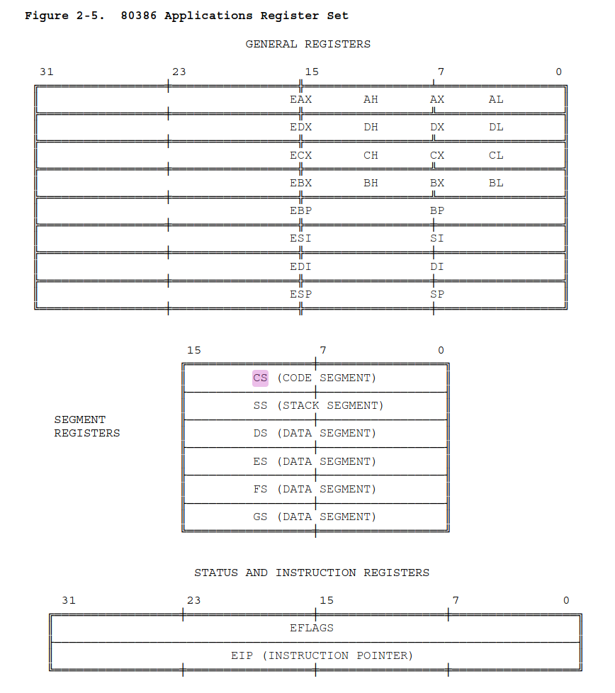
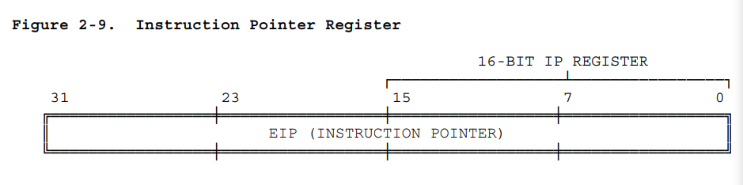

# 教材习题3

## 3-9说明模型机中下列寄存器的作用: 通用寄存器、暂存器、IR、PC、SP、MAR、MDR

 有关寄存器，我翻到了这本80386手册， 我觉得讲的挺清楚的：
 [https://pdos.csail.mit.edu/6.828/2018/readings/i386.pdf](https://pdos.csail.mit.edu/6.828/2018/readings/i386.pdf)

接下来 我对这本书的`2.3 Registers`这一部分 进行翻译:

### 2.3 Registers 寄存器

> The 80386 contains a total of sixteen registers that are of interest to the applications programmer. As Figure 2-5 shows, these registers may be grouped into these basic categories:
> 
> 1. General registers. These eight 32-bit general-purpose registers are
used primarily to contain operands for arithmetic and logical
operations.
> 2. Segment registers. These special-purpose registers permit systems
software designers to choose either a flat or segmented model of
memory organization. These six registers determine, at any given time,
which segments of memory are currently addressable.
> 3. Status and instruction registers. These special-purpose registers are
used to record and alter certain aspects of the 80386 processor state.

80386架构总共包含16个寄存器，这16个寄存器对于应用程序员来说是比较值得关注的。正如图2-5所示，这些寄存器也许可以像这样 被分成三类：

1. 通用寄存器。 这八个32-bit通用寄存器主要被用来存储 用于算术运算和逻辑运算的 操作数。
2. 段寄存器。这些特殊用途的寄存器 允许系统软件设计人员 去选择内存组织模型： 要么是平铺的，要么是分段的。 这些六个寄存器决定了，在任何给定的时间， 哪几段内存空间是当前可被寻址的。
3. 状态寄存器和指令寄存器。这些特殊用途的寄存器 被用来去存储和切换 80386处理器状态的某些方面。

Figure 2-5. 80386 Applications Register Set 

图 2-5. 应用场景中的各个寄存器组

#### 2.3.1 General Registers   通用寄存器

> The general registers of the 80386 are the 32-bit registers EAX, EBX, ECX,
EDX, EBP, ESP, ESI, and EDI. These registers are used __interchangeably__ to
contain the operands of logical and arithmetic operations. They may also be
used __interchangeably__ for operands of address computations (except that ESP
cannot be used as an index operand).
> 
> As Figure 2-5 shows, the low-order word of each of these eight registers
has a separate name and can be treated as a unit. This feature is useful for
handling 16-bit data items and for compatibility with the 8086 and 80286
processors. The word registers are named AX, BX, CX, DX, BP, SP, SI, and DI.
> 
> Figure 2-5 also illustrates that each byte of the 16-bit registers AX, BX,
CX, and DX has a separate name and can be treated as a unit. This feature is
useful for handling characters and other 8-bit data items. The byte
registers are named AH, BH, CH, and DH (high bytes); and AL, BL, CL, and DL
(low bytes).
> 
> All of the general-purpose registers are available for addressing
calculations and for the results of most arithmetic and logical
calculations; however, a few functions are __dedicated__ to certain registers.
By __implicitly__ choosing registers for these functions, the 80386 architecture
can encode instructions more compactly. The instructions that use specific
registers include: double-precision multiply and divide, I/O, string
instructions, translate, loop, variable shift and rotate, and stack
operations.

80386的通用寄存器是32-bit寄存器: EAX, EBX, ECX, EDX, EBP, ESP, ESI, 和 EDI。 这些寄存器可以互换使用，以存放逻辑运算和算数运算的操作数。他们也可被互换使用，用于存放地址计算的操作数（但是ESP不能被用作索引操作数）

*我的思考： 这里的`interchangeably`是不是可以这样理解： 这八个寄存器 功能上是相似的，或者说等价的，其中 数据可以互换，程序员可以灵活决定如何使用这些寄存器？*

*注：__interchangeable[ADJ]可互换的__， 柯林斯词典解释: Things that are interchangeable can be exchanged with each other without it making any difference. 可互换的*

如图2-5所示，这八个寄存器， 每个寄存器的低八位（low-order word）都有单独的名称，可以被当作一个独立的单元进行处理。这个特性在某些场景下很有用，如：处理16-bit的数据项，或者向前和8086, 80286的处理器兼容。字寄存器被成为  AX, BX, CX, DX, BP, SP, SI, 和 DI。

*注： word —— 字 —— 8bit( 在80386机器上 )*

图2-5还阐明了 16位寄存器AX, BX, CX, DX的每一个byte都有一个独立的名称，可以被看作是一个单独的单元。这个特性在某些场景下很有用，如: 处理字符和其他的8bit数据项。高八位的byte寄存器被称为AH, BH, CH 和 DH， 然后低八位的byte寄存器被成为AL, BL, CL 和 DL。

*我的思考： 8位可以用来处理字符，联想到C的char变量？ 8bit 256种不同的编码， 足以cover所有的ascii字符*

所有的通用寄存器都可用于： 地址计算、存储大多数算数计算和逻辑运算的运算结果; 然而，少数的功能是专门分配给特定的寄存器的。 针对这些 负责专门功能的寄存器， 可以通过**隐式**的选择**功能专用寄存器**, 80386架构可以实现更加紧凑的编码。 使用特定隐性寄存器的指令包括：双精度乘法除法、输入/输出、字符串指令、转换、循环、变量移位和旋转 以及  堆栈操作。

*注: __dedicated[ADJ]专用的__ 柯林斯词典解释： You use dedicated to describe something that is made, built, or designed for one particular purpose or thing.*

## “暂存器”

然后，习题里还提到了暂存器这个词，我一开始还以为是和寄存器是不同的东西。 然后我就怀着好奇心去google了。 结果, __something frustrating__ 出现了：在[维基百科](https://zh.wikipedia.org/zh-cn/%E5%AF%84%E5%AD%98%E5%99%A8)中， ”寄存器“和”暂存器“指向同一个词条 —— "Register".

以下几个链接可以用来证明：  
https://zh.wikipedia.org/zh-cn/%E5%AF%84%E5%AD%98%E5%99%A8  
https://zh.wikipedia.org/zh-hk/%E5%AF%84%E5%AD%98%E5%99%A8  
https://zh.wikipedia.org/zh-mo/%E5%AF%84%E5%AD%98%E5%99%A8  
https://zh.wikipedia.org/zh-my/%E5%AF%84%E5%AD%98%E5%99%A8  
https://zh.wikipedia.org/zh-sg/%E5%AF%84%E5%AD%98%E5%99%A8  
https://zh.wikipedia.org/zh-tw/%E5%AF%84%E5%AD%98%E5%99%A8  

*我的思考： 之前在课上，陈恺萌老师说: '__我们的教材有防自学的设计__'。  
 确实，for example, 我发现的现象1：这里用”暂存器“，前面有用”寄存器“，术语不统一。 现象2： 在题目给出词语的时候，应该先说”寄存器“，然后再说”通用寄存器“， 因为这二者 是前者包含后者的两个概念。然而实际上是反过来的，先说”通用寄存器“， 然后再说”寄存器“。  
 综上，我也和老师的看法一样，我们的教材有防自学设计。*

回归正题，以下是维基百科 对于”寄存器“的解释：

> 寄存器（Register）是中央处理器内用来暂存指令、数据和地址的存储器。寄存器的存贮容量有限，读写速度非常快。在计算机体系结构里，寄存器存储在已知时间点所作计算的中间结果，通过快速地访问数据来加速计算机程序的执行。[1] 

由此，我们可以给寄存器总结几个简单的特征：  
- 频繁访问  
- 速度快  
- 容量有限  

 
接着看下一个：

## IR ( Instruction Register ) 

维基百科对于这个词条的解释：

> In computing, the instruction register (IR) or current instruction register (CIR) is the part of a CPU's control unit that holds the instruction currently being executed or decoded.[1] In simple processors, each instruction to be executed is loaded into the instruction register, which holds it while it is decoded, prepared and ultimately executed, which can take several steps.

在计算机中，指令寄存器(IR)或者说 当前指令寄存器(CIR) 是CPU控制单元的一部分，负责保存当前正在执行或者解码的指令。在简单的处理器中，每一条待执行指令都会被加载到这个指令寄存器中， 在解码、准备、最终个执行的过程中 一直存着这个指令， 而这个过程（指前面的三步？） 可能需要多个步骤。

> Some of the complicated processors use a pipeline of instruction registers where each stage of the pipeline does part of the decoding, preparation or execution and then passes it to the next stage for its step. Modern processors can even do some of the steps out of order as decoding on several instructions is done in parallel.

有一些复杂的处理器使用一种 ”IR的流水线“ 的结构。在这个流水线中， 每一个阶段都会做下面事情的部分：  
&emsp;&emsp;&emsp;解码、准备 或 执行  
然后把结果传递给下一个阶段进行处理。  
现在处理器甚至可以乱顺执行，因为解码若干条指令可以并行。

> Decoding the op-code in the instruction register includes determining the instruction, determining where its operands are in memory, retrieving the operands from memory, allocating processor resources to execute the command (in super scalar processors), etc.

解码 指令寄存器中的操作码 这个过程包括：
- 决定操作类型、
- 决定操作数在内存中的位置、
- 从内存中取数
- 分配处理器资源以执行指令（在super scalar处理器中）
- 等等......

*注： __retrieve[V-T]取回，找回__ If you retrieve something, you get it back from the place where you left it.*

> The output of the IR is available to control circuits, which generate the timing signals that control the various processing elements involved in executing the instruction.

指令寄存器的输出可以用来控制电路， 然后生成时序信号 来控制各个 用来执行指令的处理器元件。

> In the instruction cycle, the instruction is loaded into the instruction register after the processor fetches it from the memory location pointed to by the __program counter__. 

在指令周期中，处理器从 被程序计数器PC指向的内存位置 获取指令以后， 将其加载到指令寄存器中。

## PC ( Program Counter )

维基百科对于这个词条的解释：

> The program counter (PC),[1] commonly called the instruction pointer (IP) in Intel x86 and Itanium microprocessors, and sometimes called the instruction address register (IAR),[2][1] the instruction counter,[3] or just part of the instruction sequencer,[4] is a processor register that indicates where a computer is in its program sequence.[5][nb 1]

程序计数器(PC), 在Intel x86和Itanium微处理器中通常被称为指令指针(IP), 有时被成为指令地址寄存器(IAR)、指令计数器 或 仅仅是指令序列发生器的部分， 是一个处理器寄存器， 这个寄存器指明了 计算机当前在 指令序列中的位置。

*我的思考： 指令序列？内存中的某个存指令的区间？*

> Usually, the PC is incremented after fetching an instruction, and holds the memory address of ("points to") the next instruction that would be executed.[6][nb 2]

通常，在获取一个指令以后， PC会自增，并保存住下一条i将要被执行的指令的地址（这个动作被称作”指向“）

> Processors usually fetch instructions sequentially from memory, but __control transfer__ instructions change the sequence by placing a new value in the PC. These include branches (sometimes called jumps), subroutine calls, and returns. A transfer that is conditional on the truth of some assertion lets the computer follow a different sequence under different conditions.

处理器通常按照顺序 从内存中获取指令，但是 __控制转移__ 指令 会改变这个顺序， 通过在PC中放一个新的值。  
 
控制转移指令包括:
- 分支（有的时候叫跳转）
- 子过程调用
- 返回  
   

一个 基于某些断言判断的真值 的控制转移指令 让计算机能够在不同的条件下遵从一个不同的指令序列。

*注： __assertion[ADJ]断言__， 柯林斯词典解释： a declaration that is made emphatically (as if no supporting evidence were necessary) (emphatically means "without question and beyond doubt".)*

> A branch provides that the next instruction is fetched from elsewhere in memory. A subroutine call not only branches but saves the preceding contents of the PC somewhere. A return retrieves the saved contents of the PC and places it back in the PC, resuming sequential execution with the instruction following the subroutine call. 

一个分支指令 使得 下一个指令 可以从内存中的另一个位置 被取回。  
  
一个子过程调用 不仅会分支，而且会将之前的PC的值存到另一个地方。  
    
一个返回语句 把之前存到另一个地方的PC的值 取回来， 然后把它放回到PC中，从而恢复 对于指令的顺序执行， 而这些指令是跟随在子过程调用之后的。 

然后捏，上面的[维基百科 Program Counter词条](#pc-section) 提到了： 在x86架构中，Program Counter 的名字叫做"__IP__"。 所以我接着去翻阅了80386手册的内容：

## 2.3.4.3 Instruction Pointer   指令指针
> The instruction pointer register (EIP) contains the offset address,
relative to the start of the current code segment, of the next sequential
instruction to be executed. The instruction pointer is not directly visible
to the programmer; it is controlled implicitly by control-transfer
instructions, interrupts, and exceptions.

指令指针寄存器(EIP)包含了 下一条即将被执行的顺序指令的 偏移地址，而这个“偏移”是相较于当前代码段的起始地址。指令指针对于程序员来说 并不是直接可见的; 指令指针 是由 控制转移指令、中断、异常 隐式控制的。

> As Figure 2-9 shows, the low-order 16 bits of EIP is named IP and can be
used by the processor as a unit. This feature is useful when executing
instructions designed for the 8086 and 80286 processors.  

如图2-9所示， EIP的低16位被称作IP，可以被处理器看作是一个独立的单元来使用。 这个特性在某些场景下很有用，比如 运行 为8086和80286处理器设计的指令。

Figure 2-9. Instruction Pointer Register

图2-9. 指令指针寄存器

*有关IR和PC： 询问gpt以后，得到结果：PC（程序计数器）通常指向下一条要执行的指令地址，而 IR（指令寄存器）则保存当前正在执行的指令。*

## SP ( Stack Pointer )

ChatGPT - 4o mini的回答：
> 堆栈指针的作用：用于指向当前堆栈的顶部。堆栈是一种后进先出（LIFO）的数据结构，通常用于存储函数调用时的返回地址、局部变量等。SP 会随着数据的压入和弹出而变化。
  
 

然后我还找到了一篇[文章](https://www.techtarget.com/whatis/definition/stack-pointer)，讲的也挺好的:
> __What is stack pointer?__
> 
> A stack pointer is a small register that stores the memory address of the last data element added to the stack or, in some cases, the first available address in the stack. A stack is a specialized buffer that is used by a program's functions to store data such as parameters, local variables and other function-related information. The stack pointer -- also referred to as the extended stack pointer (ESP) -- ensures that the program always adds data to the right location in the stack.

__什么是栈指针？__

栈指针是一个小型寄存器，存储了 最后一个加入到栈中的数据元素 的内存地址， 或者，在某些其他情况下，存储了栈中的第一个可用的地址。 一个栈 是一个专门的缓冲区，被一个程序的函数使用， 用来存数据， 比如参数、本地变量 以及 其他函数相关的信息。 栈指针（同样被成为扩展栈指针ESP）确保了程序总是 把数据加到栈中的正确位置。

接下来，看一下Inten 80386手册中，对于栈功能实现的介绍：

## 2.3.3 Stack Implementation 栈的实现
> Stack operations are facilitated by three registers:
栈操作 由三个寄存器 来帮助促进实现：

*注：__facilitate[V-T]使便利，使促进__ To facilitate an action or process, especially one that you would like to happen, means to make it easier or more likely to happen.*

> 1. The stack segment (SS) register. Stacks are implemented in memory. A
system may have a number of stacks that is limited only by the maximum
number of segments. A stack may be up to 4 gigabytes long, the maximum
length of a segment. One stack is directly addressable at a time──the
one located by SS. This is the current stack, often referred to simply
as "the" stack. SS is used automatically by the processor for all
stack operations.
1. 段寄存器(SS)。 栈是在内存中被实现的 *(主存？)* 。一个机器系统可以有多个栈，其数量的上限由段的最大数量决定。一个栈的最大长度是4GB *(4*10^9*8bit)*, 即一个段的最大长度。每一次只能直接的访问一个栈 —— 被SS指向的那一个， 被默认看作是当前的栈。 处理器会自动使用SS进行所有的栈操作。

>2. The stack pointer (ESP) register. ESP points to the top of the
push-down stack (TOS). It is referenced implicitly by PUSH and POP
operations, subroutine calls and returns, and interrupt operations.
When an item is pushed onto the stack (see Figure 2-7), the processor
decrements ESP, then writes the item at the new TOS. When an item is
popped off the stack, the processor copies it from TOS, then
increments ESP. In other words,  __the stack grows down in memory toward lesser addresses__ .
2. 栈指针寄存器(ESP)。ESP指向当前栈的栈顶。 这个寄存器 以下操作的隐式参数:
  - 子过程调用
  - 函数返回
  - 中断操作
当一个元素被压到栈顶的时候，处理器会使ESP自减，然后在新的栈顶写下这个元素。当一个元素被抛出栈顶的时候，处理器从栈顶读取数据，然后让ESP自减。  
换句话说，栈 在内存空间中 向低地址增长 *(高地址是栈顶，然后入栈时 ESP向低地址偏移，出栈的时候向高地址偏移)*

> 3. The stack-frame base pointer (EBP) register. The EBP is the best
choice of register for accessing data structures, variables and
dynamically allocated work space within the stack. EBP is often used
to access elements on the stack relative to a fixed point on the stack
rather than relative to the current TOS. It typically identifies the
base address of the current stack frame established for the current
procedure. When EBP is used as the base register in an offset
calculation, the offset is calculated automatically in the current
stack segment (i.e., the segment currently selected by SS). Because
SS does not have to be explicitly specified, instruction encoding in
such cases is more efficient. EBP can also be used to index into
segments addressable via other segment registers.

3. 栈帧基地址指针寄存器(EBP)。如果要访问 栈空间当中的 数据结构、变量、动态分配的操作空间， EBP是最佳的选择。 通常情况下，用EBP来访问元素的使用方式： 是相对于一个固定点的，而不是当前的栈顶。EBP通常指向当前过程所对应的栈帧的基地址 *(这句话可以理解成： 栈帧指向当前的栈帧，而当前的栈帧 是为了现在正在执行的过程建立的 )*。在偏移地址计算当中，当EBP被用作基地址寄存器， 偏移量会自动的在当前的堆栈段被计算（即：当前被SS选中的段）。 因为SS不需要被显式的指明，像这样的指令编码 会更加高效。 EBP也同样可以被用于访问可寻址的段，比如 通过其他段寄存器 *（EBP作为基地址，其他寄存器作为偏移量）* 。

## MAR ( Memory Address Register )

维基百科对于这个词条的解释：
> In a computer, the memory address register (MAR)[1] is the CPU register that either stores the memory address from which data will be fetched to the CPU registers, or the address to which data will be sent and stored via system bus. 

在计算机当中，内存地址寄存器(MAR) 是一个CPU寄存器，
- 要么存储一个内存地址
  - 这个内存地址的数据 是即将要被送到CPU寄存器当中的
- 要么存储一个内存地址
  - 这个内存地址将会装一个数据， 这个数据将会通过系统总线发送出去，然后存起来

> In other words, this register is used to access data and instructions from memory during the execution phase of instruction. MAR holds the memory location of data that needs to be accessed. When reading from memory, data addressed by MAR is fed into the MDR (memory data register) and then used by the CPU. When writing to memory, the CPU writes data from MDR to the memory location whose address is stored in MAR. MAR, which is found inside the CPU, goes either to the RAM (random-access memory) or cache.

换句话说，在执行指令的过程中 这个寄存器被用来 在内存中 访问数据和指令。  
MAR保存了 需要被获取的数据 在内存当中的地址。   
当 从内存中读取数据的时候，被 __MAR当中的地址__ 标记的 __数据内容__ 被放进MDR， 然后被CPU使用。  
当 往内存中写数据的时候， CPU从MDR取出数据，然后写到内存当中的指定位置， 这个地址内容在MAR但中。   
MAR，存在于CPU当中，并且连接、访问RAM和cache。

> The MAR register is half of a minimal interface between a microprogram and computer storage; the other half is a MDR.

MAR寄存器是 微程序和计算机存储之间的 最小接口的一半; 另一半是MDR。

> In general, MAR is a parallel load register that contains the next memory address to be manipulated, for example the next address to be read or written. 

通常，MAR是一个并行的加载寄存器， 包含了下一个将要被操作的内存地址， 如：下一个 要读 or 写的 地址。

## MDR/MBR ( Memory Data Register / Memory Buffer Register )

维基百科对于这个词条的解释：
> A memory buffer register (MBR) or memory data register (MDR) is the register in a computer's CPU that stores the data being transferred to and from the immediate access storage. It contains a copy of the value in the memory location specified by the memory address register. It acts as a buffer,[1] allowing the processor and memory units to act independently without being affected by minor differences in operation. A data item will be copied to the MBR ready for use at the next clock cycle, when it can be either used by the processor for reading or writing, or stored in main memory after being written.

一个内存缓冲寄存器（MBR） 或者叫内存数据寄存器（MDR）是一个计算机CPU当中的寄存器， 用来存储 来自或者去往快速存储器 的数据。

> This register holds the contents of the memory which are to be transferred from memory to other components or vice versa. A word to be stored must be transferred to the MBR, from where it goes to the specific memory location, and the arithmetic data to be processed in the ALU first goes to MBR and then to accumulated register, and then it is processed in the ALU.

MBR这个寄存器保存了内存的内容， 这个内容有可能是从内存空间到其他部件的，或者是方向反过来的。 一个数据，从出发 到 到达特定内存空间的过程当中，必须要经过MBR; 还有， 要在ALU当中被处理的算数数据要先进到MBR，然后才是去累加寄存器，然后再去ALU当中进行处理。

> The MDR is a two-way register.[2] When data is fetched from memory and placed into the MDR, it is written to go in one direction. When there is a write instruction, the data to be written is placed into the MDR from another CPU register, which then puts the data into memory. 

MDR是一个双向的处理器。当数据从内存当中被取出 然后被放进MDR，然后再按照某个方向传输进CPU寄存器（？）。 当有一个写数据的指令的时候，将要被写的数据将会从另一个CPU寄存器中被取出， 然后被放进MDR，然后再放到内存空间中。

## 3-12 拟出下述指令的读取与执行流程
### (1) 指令：MOV R0, R2

1. 指令获取：
- CPU 从指令缓存或主内存中获取当前指令地址（PC指向的位置）。
- 将指令 MOV R0, R2 读入指令寄存器（IR）。

2. 指令解码：
- CPU 解码指令，识别操作码和操作数。

3. 操作数读取：
CPU 访问寄存器 R2，读取其当前值。

4. 执行操作：
- 将 R2 的值写入 R0 寄存器。

5. 更新程序计数器 (PC)：
- PC 增加，指向下一条指令。
### (2) 指令：MOV R1, (PC)+
1. 指令获取:
- CPU从指令缓存或者主存获取当前的指令地址（PC指向的位置）。
- 将指令读入指令寄存器(IR)。

2. 指令解码:
- CPU解码指令， 识别操作码和操作数

3. 操作数计算:
- 计算当前的PC的值，确定从哪个位置读取数据。
- 在读取以后， PC的值递增。

4. 操作数读取:
- 从内存中读取PC指向的地址的数据

5. 执行操作:
- 将读取到的数据写入R1寄存器

6.更新程序计数器(PC):
- PC的值自增，准备指向下一条指令。