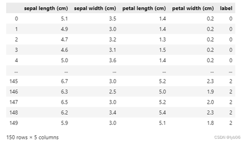

# 实验报告模板：

```
实 验 报 告

课程名称：机器学习

班级：   XXXX

学号：XXXX

姓名：XXXX

实验日期：2024 年 3 月 1 日

实验名称：实验一 熟悉SKLearn库

实验目的：

安装python、编辑器和SKlearn库；熟悉机器学习模型的训练、测试、交叉验证、评价等基本流程。

1.加载数据集，可以使用其它任何数据集，不局限于iris

2.划分数据集

#两种做法：1.分成训练集和测试集；2.采用K折交叉验证；

3.选择一个分类模型（线性回归、svm等），自己编写，或网上下载，或调用sklearn库，进行训练；

4. 输出在测试集上的精度；

要求：多次划分数据集，即跑多次实验，得到多个精度；

附加：尝试算出模型的偏差和方差

二.实验平台：

Python 3.X 

实验内容与结果：

3.1 核心功能实现

XXXXXXXX

3.2 结果与分析：（可以包含数据集分析、实验过程、结果截图、结果分析等）

XXXXXXX

3.3 实验总结

XXXXXXX

附录：代码
```

# ppt内容：
```
实验一——熟悉sklearn库

安装python
安装编辑器
pip安装scikit-learn包

内容1
1.加载数据集，可以使用其它任何数据集，不局限于iris
2.划分数据集
#两种做法：1.分成训练集和测试集；2.采用K折交叉验证；
3.选择一个分类模型（线性回归、svm等），自己编写，或网上下载，或调用sklearn库，进行训练；
4. 输出在测试集上的精度；

要求：多次划分数据集，即跑多次实验，得到多个精度；
附加：尝试算出模型的偏差和方差

实验报告
报告要求：
按实验报告模板填写，附上源代码文件。
截至时间：
下节实验课的前一天20：00前，课堂派提交

Python基础
#coding:utf-8
num=0
for i in range(1,5):
    for j in range(1,5):
        for k in range(1,5):
            if(i!=k) and (i!=j) and (j!=k):
                num+=1
print("num:{}".format(num))

Python基础

#coding:utf-8
def funfib(n):
    a,b=1,1
    for i in range(n-1):
        a,b=b,a+b
    return a

print(funfib(4))

鸢尾花（Iris）数据集

3类：
狗尾草鸢尾（Iris-setosa）、杂色鸢尾（Iris-versicolor）和维吉尼亚鸢尾（Iris-virginica）


4个特征：
花萼长度（sepal length）、花萼宽度（sepal width）、花瓣长度（petal length）、花瓣宽度（petal width）


150条数据：


```




