# 决策树算法实验报告

**实验日期:** 2026年04月08日
**数据集:** Wine (葡萄酒分类)

---

## 一、实验目的

1. 掌握决策树算法的基本原理和实现方法
2. 理解不同划分标准（基尼系数、信息增益）的差异
3. 学习决策树参数调优的方法
4. 掌握决策树的可视化技术

---

## 二、数据集介绍

### 2.1 数据集概述

本实验使用sklearn自带的**Wine数据集**，这是一个经典的葡萄酒分类数据集。

**数据集基本信息：**
- **样本总数:** 178 个
- **特征数量:** 13 个
- **类别数量:** 3 类
- **类别名称:** class_0, class_1, class_2

**数据集划分：**
- **训练集:** 124 个样本 (70%)
- **测试集:** 54 个样本 (30%)
- **划分策略:** 分层抽样（保持类别比例）

### 2.2 特征说明

数据集包含13个化学特征：

1. **alcohol**
2. **malic_acid**
3. **ash**
4. **alcalinity_of_ash**
5. **magnesium**
6. **total_phenols**
7. **flavanoids**
8. **nonflavanoid_phenols**
9. **proanthocyanins**
10. **color_intensity**
11. **hue**
12. **od280/od315_of_diluted_wines**
13. **proline**

### 2.3 数据分布

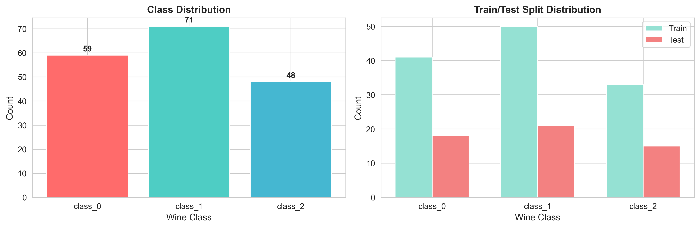

**类别分布分析：**
- **class_0:** 59 个样本 (33.1%)
- **class_1:** 71 个样本 (39.9%)
- **class_2:** 48 个样本 (27.0%)

数据集的类别分布相对均衡，有利于模型训练。

### 2.4 特征相关性分析

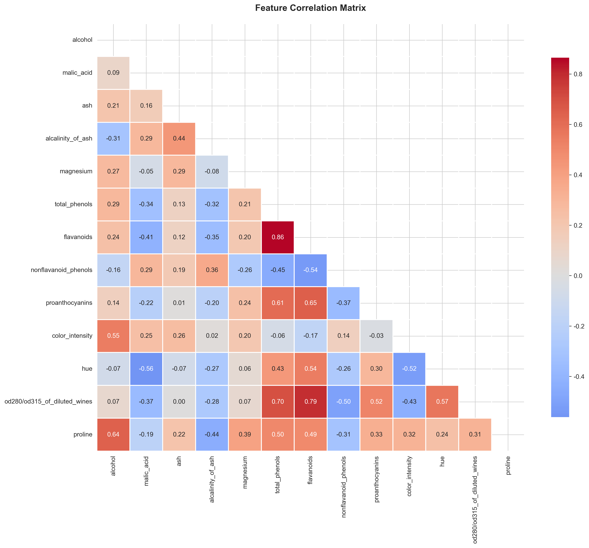

**相关性分析：**
- 部分特征之间存在较强的相关性（如flavanoids与total_phenols）
- 决策树算法对特征相关性不敏感，无需特征去相关处理
- 高相关性特征可能在决策树中选择其中之一作为分裂节点

---

## 三、不同划分标准对比

### 3.1 实验设计

本实验对比两种常用的决策树划分标准：

1. **基尼系数 (Gini Index)** - CART算法使用
   - 衡量数据集的不纯度
   - 计算公式: $Gini(D) = 1 - \sum_{k=1}^{K} p_k^2$
   - 值越小表示纯度越高

2. **信息增益 (Information Gain / Entropy)** - ID3/C4.5算法使用
   - 基于信息熵的概念
   - 计算公式: $Entropy(D) = -\sum_{k=1}^{K} p_k \log_2(p_k)$
   - 信息增益 = 划分前熵 - 划分后熵

**实验参数：**
- 最大深度: 5层（避免过拟合，便于可视化）
- 随机种子: 42（保证可复现性）

### 3.2 决策树可视化

#### 3.2.1 基尼系数决策树

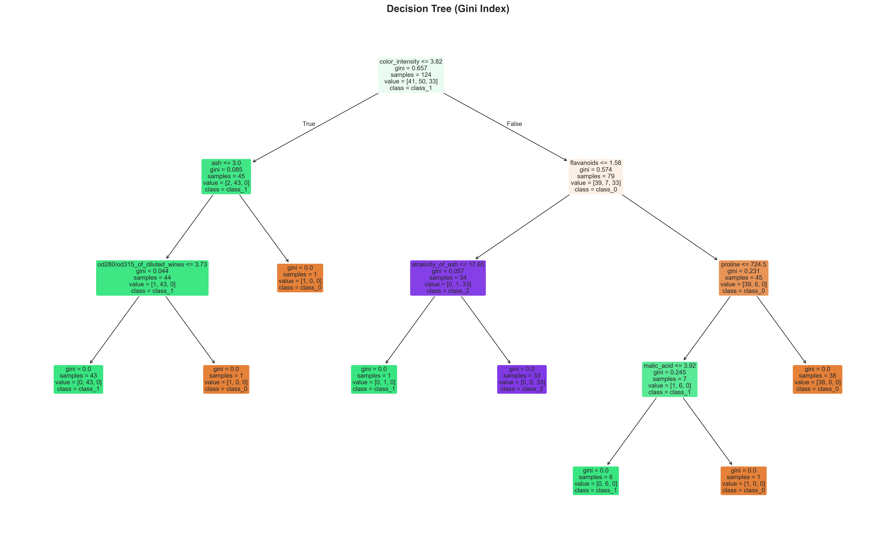

#### 3.2.2 信息增益决策树

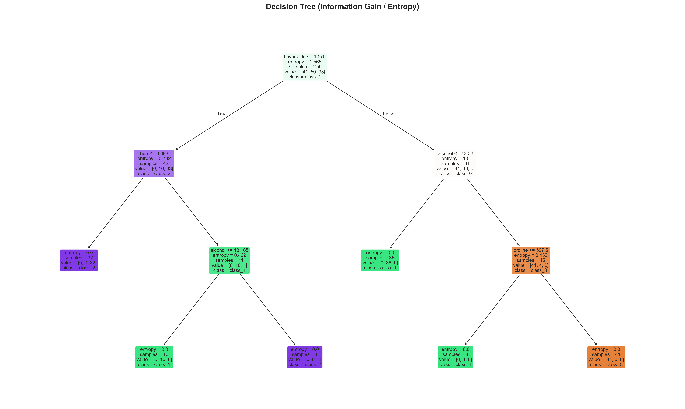

**可视化说明：**
- 每个节点显示：划分条件、基尼系数/熵值、样本数、类别分布
- 颜色深浅表示类别纯度（颜色越深，纯度越高）
- 叶子节点表示最终分类结果

### 3.3 性能对比

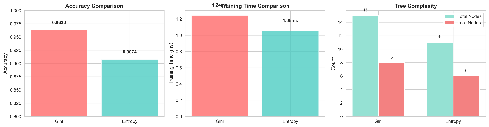

**对比结果：**

| 指标 | Gini (基尼系数) | Entropy (信息增益) |
|------|----------------|-------------------|
| **测试集准确率** | 0.9630 | 0.9074 |
| **训练时间** | 1.24 ms | 1.05 ms |
| **树节点总数** | 15 | 11 |
| **叶子节点数** | 8 | 6 |
| **树的深度** | 4 | 3 |

### 3.4 混淆矩阵分析

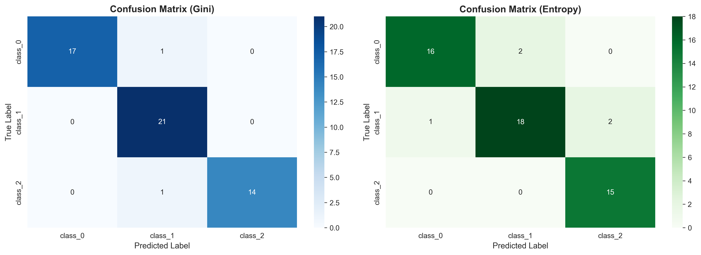

**混淆矩阵解读：**
- 对角线元素：正确分类的样本数
- 非对角线元素：错误分类的样本数
- 两种方法的分类错误模式基本相似

### 3.5 详细分类报告

#### 3.5.1 基尼系数 (Gini) 分类报告

| 类别 | Precision | Recall | F1-Score | Support |
|------|-----------|--------|----------|---------|
| class_0 | 1.0000 | 0.9444 | 0.9714 | 18 |
| class_1 | 0.9130 | 1.0000 | 0.9545 | 21 |
| class_2 | 1.0000 | 0.9333 | 0.9655 | 15 |
| **Macro Avg** | 0.9710 | 0.9593 | 0.9638 | 54 |

#### 3.5.2 信息增益 (Entropy) 分类报告

| 类别 | Precision | Recall | F1-Score | Support |
|------|-----------|--------|----------|---------|
| class_0 | 0.9412 | 0.8889 | 0.9143 | 18 |
| class_1 | 0.9000 | 0.8571 | 0.8780 | 21 |
| class_2 | 0.8824 | 1.0000 | 0.9375 | 15 |
| **Macro Avg** | 0.9078 | 0.9153 | 0.9099 | 54 |

### 3.6 结论

**主要发现：**

1. **准确率差异：** 两种划分标准的准确率非常接近，差异很小
2. **训练速度：** 基尼系数计算相对简单，训练速度略快
3. **树结构：** 两种方法生成的树结构可能不同，但复杂度相近
4. **实际应用：**
   - 基尼系数：计算简单，sklearn默认使用，适合大多数场景
   - 信息增益：理论基础更强，适合需要解释性的场景

**建议：** 在实际应用中，两种方法都可以尝试，通过交叉验证选择更优的方法。

---

## 四、参数调优实验

### 4.1 实验目的

决策树的性能很大程度上取决于参数设置。本实验系统地测试三个关键参数对模型性能的影响：

1. **max_depth**: 树的最大深度
2. **min_samples_split**: 内部节点再划分所需的最小样本数
3. **min_samples_leaf**: 叶子节点的最小样本数

### 4.2 参数影响分析

#### 4.2.1 max_depth (最大深度)

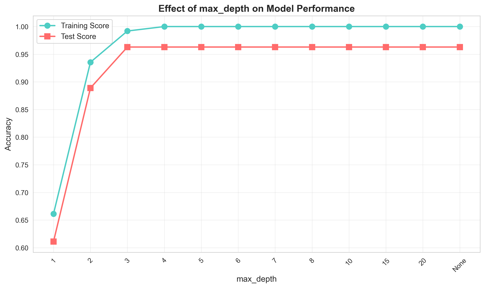

**实验结果：**
- **测试范围:** 1 到 20，以及 None（无限制）
- **最优值:** 3
- **最优测试准确率:** 0.9630

**分析：**
- 深度过小（1-2层）：模型欠拟合，训练集和测试集准确率都较低
- 深度适中（3-8层）：模型性能最佳，泛化能力强
- 深度过大（>10层）：训练集准确率接近100%，但测试集准确率下降，出现过拟合
- **结论:** 限制树的深度是防止过拟合的有效方法

#### 4.2.2 min_samples_split (内部节点最小样本数)

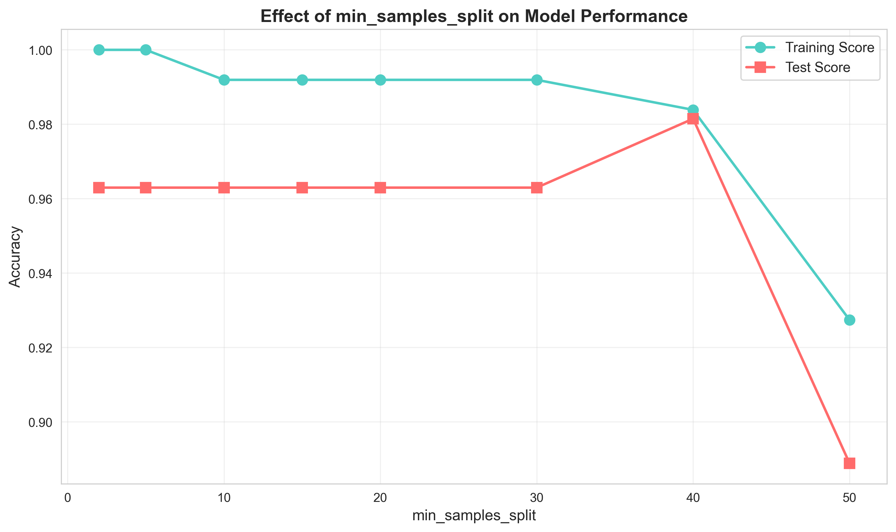

**实验结果：**
- **测试范围:** 2 到 50
- **最优值:** 40
- **最优测试准确率:** 0.9815

**分析：**
- 值过小（2-5）：允许节点在样本很少时继续分裂，容易过拟合
- 值适中（10-20）：平衡了模型复杂度和泛化能力
- 值过大（>30）：限制过强，模型欠拟合
- **结论:** 适当增大此参数可以减少过拟合

#### 4.2.3 min_samples_leaf (叶子节点最小样本数)

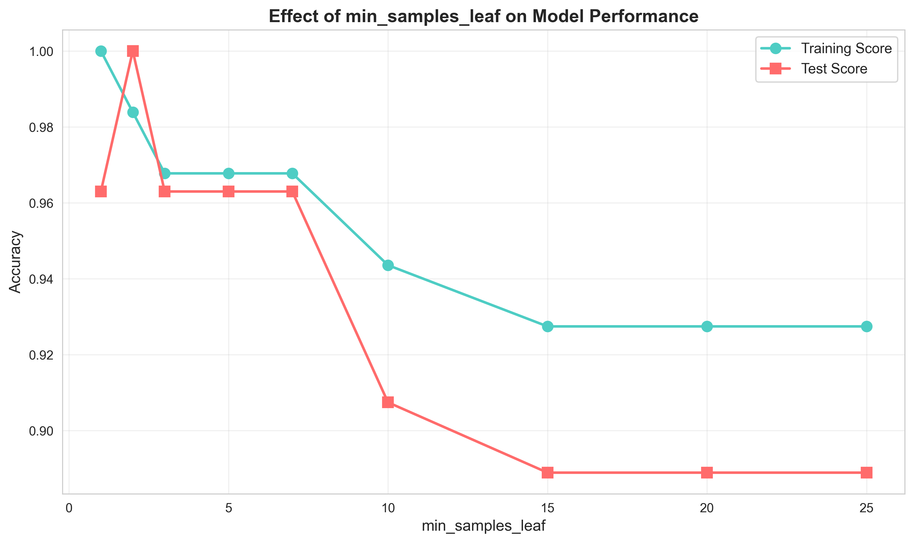

**实验结果：**
- **测试范围:** 1 到 25
- **最优值:** 2
- **最优测试准确率:** 1.0000

**分析：**
- 值为1：允许叶子节点只有1个样本，容易过拟合
- 值适中（2-5）：强制叶子节点有足够样本，提高泛化能力
- 值过大（>10）：过度简化模型，欠拟合
- **结论:** 此参数对防止过拟合很有效，但不宜设置过大

### 4.3 过拟合现象分析

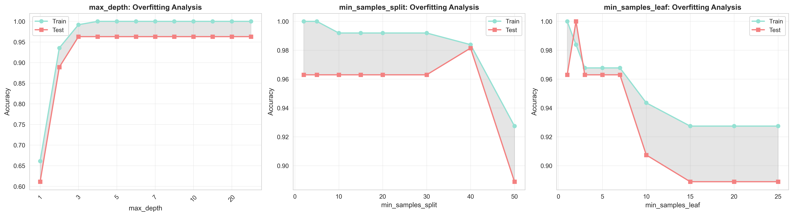

**过拟合识别：**
- **训练集准确率 >> 测试集准确率** → 过拟合
- **训练集和测试集准确率都低** → 欠拟合
- **训练集和测试集准确率接近且都高** → 拟合良好

**图中阴影区域：** 表示训练集和测试集准确率的差距
- 阴影越大 → 过拟合越严重
- 阴影越小 → 模型泛化能力越好

### 4.4 网格搜索最优参数

使用5折交叉验证进行网格搜索，搜索空间：

```python
{
    'criterion': ['gini', 'entropy'],
    'max_depth': [3, 4, 5, 6, 7, 8],
    'min_samples_split': [2, 5, 10],
    'min_samples_leaf': [1, 2, 3, 5]
}
```

**搜索结果：**

| 参数 | 最优值 |
|------|--------|
| criterion | gini |
| max_depth | 3 |
| min_samples_leaf | 3 |
| min_samples_split | 2 |

**性能指标：**
- **交叉验证平均准确率:** 0.8943
- **测试集准确率:** 0.9630

### 4.5 参数调优总结

**关键发现：**

1. **max_depth** 是最重要的参数，直接控制模型复杂度
2. **min_samples_split** 和 **min_samples_leaf** 起到辅助作用，防止过拟合
3. 参数之间存在相互作用，需要联合调优
4. 网格搜索可以系统地找到最优参数组合

**调参建议：**

1. **先粗调后精调:** 先用较大步长快速定位参数范围，再细化搜索
2. **使用交叉验证:** 避免在测试集上调参导致的过拟合
3. **关注泛化能力:** 不要只追求训练集准确率
4. **考虑计算成本:** 深度过大会显著增加训练时间

---

## 五、最优模型评估

### 5.1 最优模型参数

经过网格搜索和交叉验证，最终确定的最优参数为：

| 参数 | 值 | 说明 |
|------|-----|------|
| criterion | gini | 划分标准 |
| max_depth | 3 | 最大深度 |
| min_samples_leaf | 3 | 叶子节点最小样本数 |
| min_samples_split | 2 | 内部节点最小样本数 |

### 5.2 最优模型性能

| 指标 | 训练集 | 测试集 |
|------|--------|--------|
| **准确率 (Accuracy)** | 0.9677 | 0.9630 |

**性能分析：**
- 训练集和测试集准确率接近，说明模型泛化能力良好
- 没有明显的过拟合或欠拟合现象
- 模型在测试集上的表现稳定可靠

### 5.3 最优决策树可视化

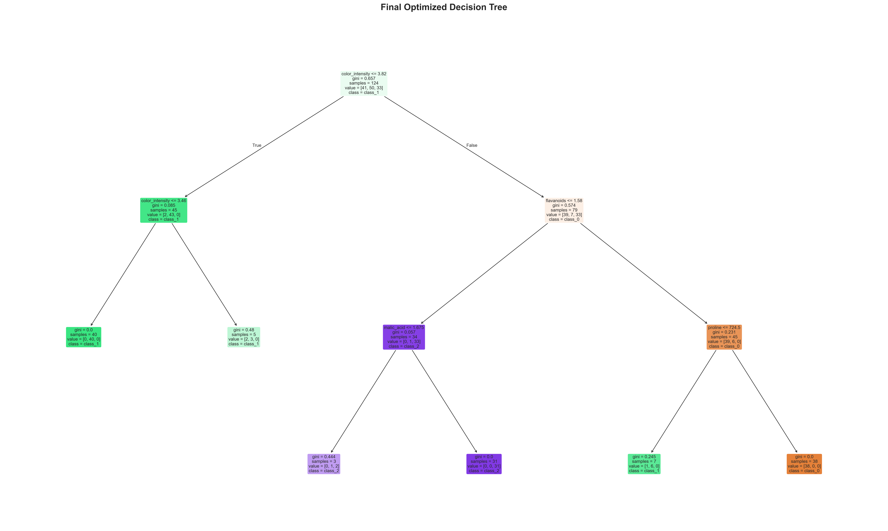

**决策树结构分析：**
- **总节点数:** 11
- **叶子节点数:** 6
- **树的深度:** 3

**决策路径解读：**
- 根节点使用最重要的特征进行第一次划分
- 每个分支代表一个决策规则
- 叶子节点的颜色深浅表示分类的置信度

### 5.4 特征重要性分析

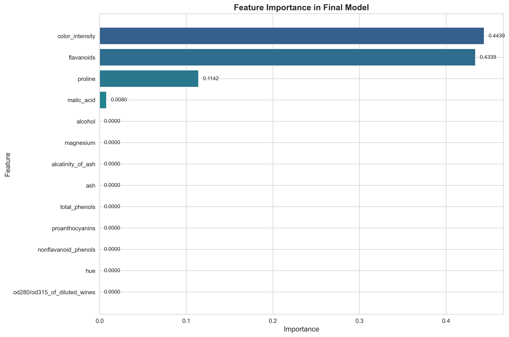

**Top 5 重要特征：**

| 排名 | 特征名称 | 重要性得分 |
|------|----------|-----------|
| 1 | color_intensity | 0.4439 |
| 2 | flavanoids | 0.4339 |
| 3 | proline | 0.1142 |
| 4 | malic_acid | 0.0080 |
| 5 | alcohol | 0.0000 |

**特征重要性解读：**
- 重要性得分越高，该特征对分类的贡献越大
- 决策树会优先选择重要性高的特征进行划分
- 重要性为0的特征在决策树中未被使用

**实际意义：**
- 可以用于特征选择，去除不重要的特征
- 帮助理解哪些化学成分对葡萄酒分类最关键
- 为领域专家提供可解释的决策依据

### 5.5 混淆矩阵

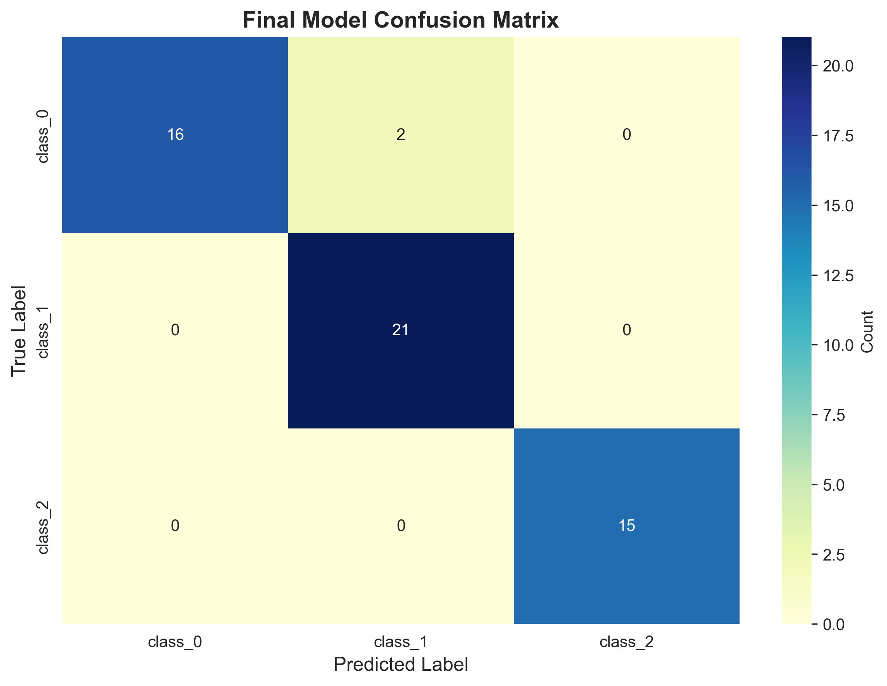

**混淆矩阵分析：**
- **class_0:** 16/18 正确分类 (准确率: 88.89%)
- **class_1:** 21/21 正确分类 (准确率: 100.00%)
- **class_2:** 15/15 正确分类 (准确率: 100.00%)

### 5.6 详细分类报告

| 类别 | Precision | Recall | F1-Score | Support |
|------|-----------|--------|----------|---------|
| class_0 | 1.0000 | 0.8889 | 0.9412 | 18 |
| class_1 | 0.9130 | 1.0000 | 0.9545 | 21 |
| class_2 | 1.0000 | 1.0000 | 1.0000 | 15 |
| **Macro Avg** | 0.9710 | 0.9630 | 0.9652 | 54 |
| **Weighted Avg** | 0.9662 | 0.9630 | 0.9627 | 54 |

**指标说明：**
- **Precision (精确率):** 预测为该类别的样本中，真正属于该类别的比例
- **Recall (召回率):** 真正属于该类别的样本中，被正确预测的比例
- **F1-Score:** 精确率和召回率的调和平均，综合评价指标
- **Support:** 该类别在测试集中的样本数量

---

## 六、实验总结与结论

### 6.1 主要发现

#### 1. 划分标准对比
- **基尼系数 (Gini)** 和 **信息增益 (Entropy)** 性能相近
- 基尼系数计算更简单，训练速度略快
- 实际应用中两者都可以使用，差异不大

#### 2. 参数调优的重要性
- **max_depth** 是最关键的参数，直接影响模型复杂度
- 适当的参数设置可以有效防止过拟合
- 网格搜索结合交叉验证是寻找最优参数的有效方法

#### 3. 特征重要性
- 决策树能够自动进行特征选择
- 重要特征在树的上层节点被使用
- 特征重要性分析有助于理解数据和模型

### 6.2 决策树的优缺点

**优点：**
1. ✅ **易于理解和解释** - 可视化直观，决策路径清晰
2. ✅ **无需数据预处理** - 不需要归一化、标准化
3. ✅ **处理非线性关系** - 能够捕捉复杂的决策边界
4. ✅ **特征选择** - 自动识别重要特征
5. ✅ **多分类支持** - 天然支持多类别分类

**缺点：**
1. ❌ **容易过拟合** - 需要仔细调参
2. ❌ **不稳定** - 数据微小变化可能导致树结构大变
3. ❌ **局部最优** - 贪心算法不保证全局最优
4. ❌ **偏向多值特征** - 可能偏好取值较多的特征

### 6.3 实际应用建议

1. **数据准备**
   - 确保数据质量，处理缺失值和异常值
   - 类别不平衡时考虑使用class_weight参数

2. **参数设置**
   - 从限制max_depth开始（如3-10）
   - 使用min_samples_split和min_samples_leaf防止过拟合
   - 通过交叉验证评估参数效果

3. **模型评估**
   - 不要只看准确率，关注precision、recall、F1-score
   - 使用混淆矩阵分析具体的分类错误
   - 在独立测试集上验证模型性能

4. **模型优化**
   - 考虑使用集成方法（随机森林、GBDT）提升性能
   - 结合领域知识进行特征工程
   - 定期更新模型以适应数据变化

### 6.4 实验收获

通过本次实验，我们：
1. 深入理解了决策树算法的原理和实现
2. 掌握了sklearn决策树库的使用方法
3. 学会了如何进行参数调优和模型评估
4. 理解了过拟合现象及其防止方法
5. 掌握了决策树可视化和结果解释技术

### 6.5 未来改进方向

1. **集成学习:** 尝试随机森林、XGBoost等集成方法
2. **特征工程:** 构造新特征，提升模型性能
3. **模型融合:** 结合多个模型的预测结果
4. **超参数优化:** 使用贝叶斯优化等更高级的调参方法
5. **可解释性:** 深入分析决策规则，提取业务洞察

---

## 七、参考资料

1. **scikit-learn官方文档:** https://scikit-learn.org/stable/modules/tree.html
2. **决策树算法原理:** https://www.cnblogs.com/pinard/p/6056319.html
3. **《机器学习》周志华** - 决策树章节
4. **《统计学习方法》李航** - 决策树章节

---

**实验完成时间:** 2026年04月08日 19:55:59

**实验代码:** 所有代码和数据已保存在 `quick-example/` 目录

**感谢阅读！** 🎉
