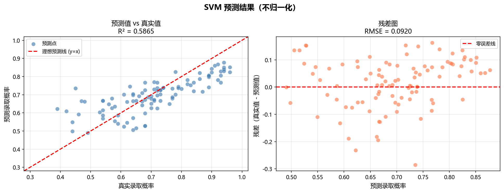
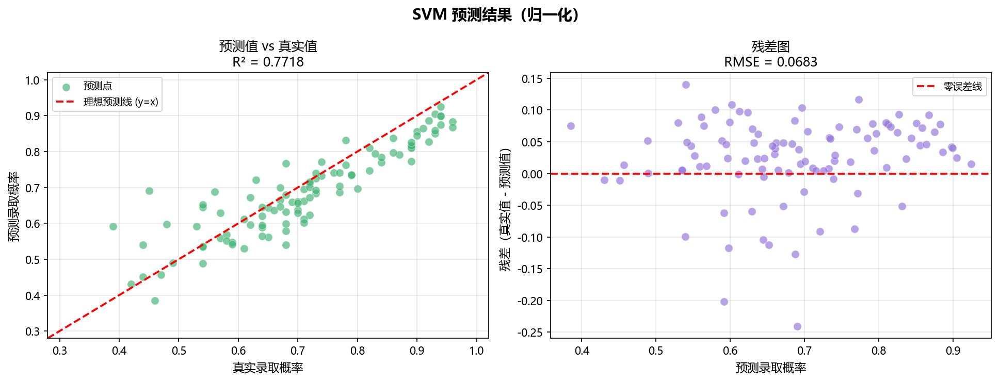
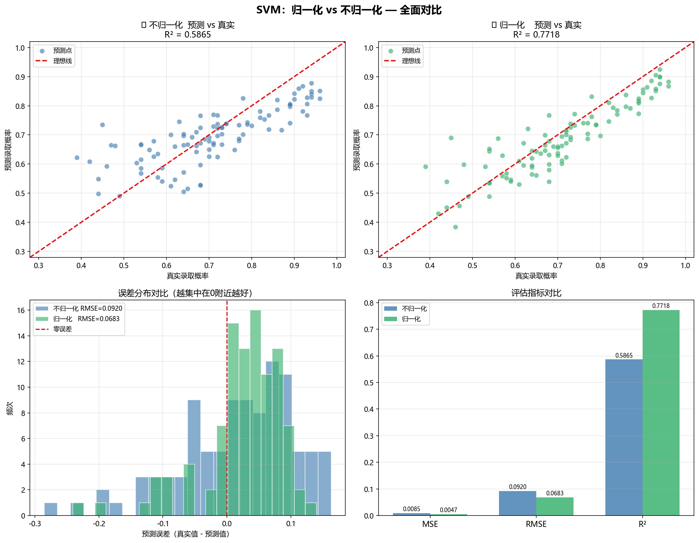

# 实验三 — SVM 预测录取率：归一化对比分析报告

> 生成时间：2026-04-09 18:24:15

---

## 一、实验背景

本实验使用研究生录取预测数据集（500条），用支持向量机（SVM）预测学生的录取概率。
我们做了同一个模型的两次实验，**唯一区别**是是否对输入特征进行归一化。

### 数据集特征
| 特征 | 含义 | 数值范围 |
|------|------|----------|
| GRE Score | GRE 考试成绩 | 290 – 340 |
| TOEFL Score | 托福成绩 | 92 – 120 |
| University Rating | 本科院校评级 | 1 – 5 |
| SOP | 目的陈述质量 | 1 – 5 |
| LOR | 推荐信质量 | 1 – 5 |
| CGPA | 本科 GPA | 6.8 – 9.9 |
| Research | 是否有研究经验 | 0 或 1 |

---

## 二、为什么归一化对 SVM 很重要？

### 2.1 问题根源：特征尺度不统一

把上表的"数值范围"对比一下：
- GRE 分数范围是 **50**（340-290）
- University Rating 范围只有 **4**（5-1）
- Research 只有 **0 或 1**

SVM 使用 **RBF 核函数**，它的核心计算是测量两个数据点之间的**距离**：

```
距离 = √[(GRE₁-GRE₂)² + (TOEFL₁-TOEFL₂)² + (Rating₁-Rating₂)² + ...]
```

问题来了：GRE 的差值动辄 10-30，而 Rating 的差值最多只有 4。
**GRE 这一个特征会"霸占"整个距离计算**，其他特征几乎没有发言权。

### 2.2 归一化的解决方案

Min-Max 归一化把所有特征压缩到 **[0, 1]** 区间：

```
新值 = (原值 - 最小值) / (最大值 - 最小值)
```

归一化后，GRE 的范围是 [0,1]，Rating 也是 [0,1]，大家"平起平坐"。

---

## 三、实验设置

- **模型**：SVR（支持向量回归），RBF 核，C=100，gamma=0.1，epsilon=0.1
- **数据划分**：训练集 400 条（80%），测试集 100 条（20%），随机种子=42
- **唯一变量**：是否用 MinMaxScaler 对特征归一化

---

## 四、实验结果

### 4.1 数值对比

| 指标 | 不归一化 | 归一化 | 变化 |
|------|----------|--------|------|
| **MSE**（↓越小越好） | 0.008456 | 0.004666 | +44.8% |
| **RMSE**（↓越小越好） | 0.091959 | 0.068306 | — |
| **R²**（↑越大越好） | 0.586484 | 0.771848 | +0.185363 |

> **结论：归一化效果更好。**

### 4.2 如何读懂这些指标？

**MSE（均方误差）**
= 预测误差的平方的平均值。越小说明预测越准。
例：MSE=0.005 意味着平均误差约为 √0.005 ≈ 0.07（录取概率差了7个百分点）

**RMSE（均方根误差）**
= √MSE，单位和预测值一样（录取概率）。
例：RMSE=0.07 意味着模型预测的录取概率平均偏差约 7%。

**R²（决定系数）**
= 模型解释了多少比例的数据变化，范围 0-1，越接近 1 越好。
例：R²=0.85 意味着模型解释了 85% 的录取概率变化。

### 4.3 可视化分析

#### 不归一化结果图



#### 归一化结果图



#### 全面对比图



图中包含 4 个子图：
1. **左上（蓝色）**：不归一化的预测 vs 真实散点图。点越靠近红色对角线，预测越准。
2. **右上（绿色）**：归一化的预测 vs 真实散点图。
3. **左下**：两组的误差分布直方图。误差越集中在 0 附近越好。
4. **右下**：三个指标的柱状对比图。

---

## 五、结论与建议

1. **归一化对 SVM 影响巨大**。SVM 使用距离计算，特征尺度不一致会导致大数值特征主导模型。

2. **实际开发中的最佳实践**：
   - 使用 `MinMaxScaler` 或 `StandardScaler` 对特征归一化
   - 注意：scaler 只在**训练集**上 `fit`，再对测试集做 `transform`（避免数据泄露）

3. **归一化不适用的情况**：
   - 决策树、随机森林不需要归一化（它们基于阈值划分，不用距离）
   - 如果特征本身尺度有意义（如经济学模型），谨慎使用

---

*本报告由 03_analysis.py 自动生成*
