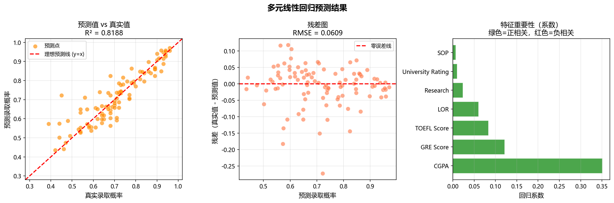
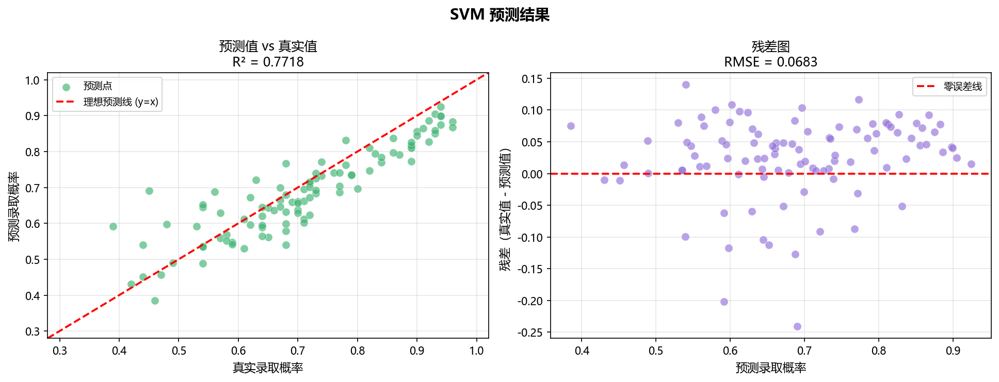
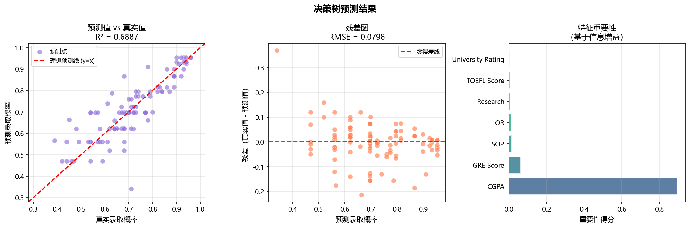
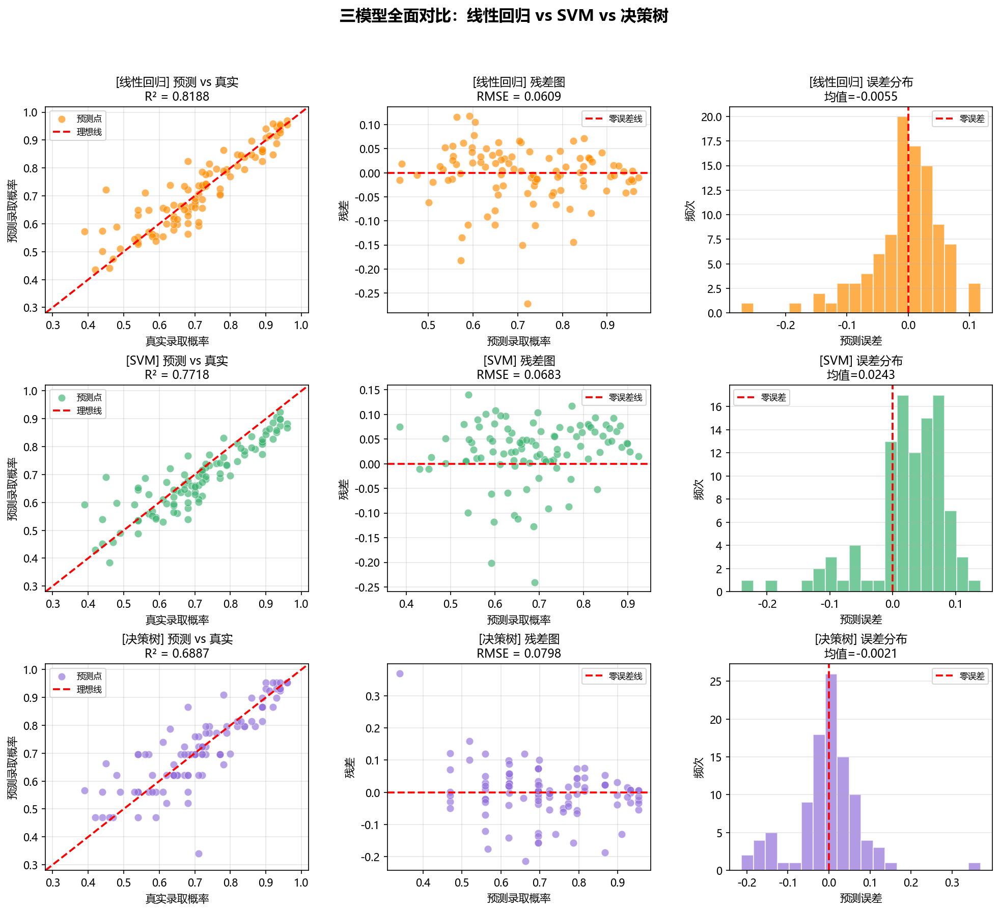
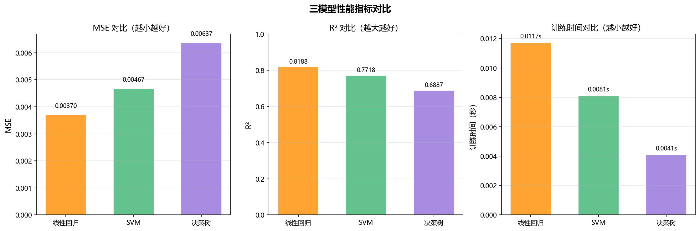

# 实验三 — SVM 预测录取率：三模型对比分析报告

> 生成时间：2026-04-09 21:33:59

---

## 一、实验背景

本实验对比三种经典机器学习算法在研究生录取预测任务上的表现：
- **多元线性回归**：最简单的线性模型
- **SVM（支持向量机）**：强大的非线性模型
- **决策树**：直观易懂的树形模型

---

## 二、三种模型简介

### 2.1 多元线性回归（Linear Regression）

**核心思想：** 假设目标值是特征的线性组合。

```
录取概率 = w₁×GRE + w₂×托福 + w₃×GPA + ... + 常数
```

**优点：**
- 训练速度快，计算简单
- 可解释性强：能看出每个特征的权重
- 不容易过拟合

**缺点：**
- 只能处理线性关系
- 对异常值敏感
- 假设特征之间相互独立

**适用场景：** 特征和目标呈线性关系，需要快速建模和解释

---

### 2.2 SVM（支持向量机）

**核心思想：** 找到最优的超平面（或曲面）来拟合数据。

使用 RBF 核函数可以处理非线性关系：
```
K(x, x') = exp(-γ||x - x'||²)
```

**优点：**
- 能处理非线性关系（通过核函数）
- 泛化能力强，不容易过拟合
- 在高维空间表现良好

**缺点：**
- 训练速度慢（尤其是大数据集）
- 参数调优复杂（C, gamma, epsilon）
- 可解释性差（黑盒模型）
- 必须归一化

**适用场景：** 数据量中等，关系复杂，追求高精度

---

### 2.3 决策树（Decision Tree）

**核心思想：** 通过一系列"是/否"问题来做决策。

```
GRE >= 320?
├─ 是 → GPA >= 8.5?
│         ├─ 是 → 录取概率 = 0.85
│         └─ 否 → 录取概率 = 0.65
└─ 否 → ...
```

**优点：**
- 非常直观，容易理解和解释
- 不需要归一化
- 能自动处理特征交互
- 能处理非线性关系

**缺点：**
- 容易过拟合（需要剪枝）
- 不够稳定（数据稍变，树结构可能完全不同）
- 对连续值预测不够精确

**适用场景：** 需要可解释性，特征有明显的阈值划分

---

## 三、实验设置

- **数据集**：研究生录取预测，7个特征，500条数据
- **数据划分**：训练集 400 条（80%），测试集 100 条（20%），随机种子=42
- **预处理**：
  - 线性回归 & SVM：MinMaxScaler 归一化
  - 决策树：不归一化（不需要）
- **模型参数**：
  - 线性回归：默认参数
  - SVM：RBF核，C=100，gamma=0.1，epsilon=0.1
  - 决策树：max_depth=5，min_samples_split=10（防止过拟合）

---

## 四、实验结果

### 4.1 数值对比

| 模型 | MSE（↓越小越好） | RMSE（↓越小越好） | R²（↑越大越好） | 训练时间 |
|------|-----------------|------------------|----------------|----------|
| **线性回归** | 0.003705 | 0.060866 | 0.818843 | 0.0117秒 |
| **SVM** | 0.004666 | 0.068306 | 0.771848 | 0.0081秒 |
| **决策树** | 0.006366 | 0.079786 | 0.688714 | 0.0041秒 |

> **结论：线性回归效果最好（R² = 0.818843）**

### 4.2 排名分析

**准确度排名（按 R² 从高到低）：**
1. **线性回归** - R² = 0.818843
2. **SVM** - R² = 0.771848
3. **决策树** - R² = 0.688714

**速度排名（按训练时间从快到慢）：**
1. **决策树** - 0.0041秒
2. **SVM** - 0.0081秒
3. **线性回归** - 0.0117秒

### 4.3 可视化分析

#### 各模型结果图









#### 指标对比图



---

## 五、深入分析

### 5.1 为什么线性回归效果最好？

**线性回归表现最好，说明：**
- 这个数据集的特征和目标之间主要是线性关系
- GRE、托福、GPA等分数与录取概率呈线性相关
- 简单模型有时比复杂模型更好（奥卡姆剃刀原则）

**启示：** 不要盲目追求复杂模型，先尝试简单模型建立基线。

### 5.2 模型选择建议

**场景1：追求最高精度**
→ 选择 **线性回归**（R² = 0.818843）

**场景2：需要快速训练**
→ 选择 **决策树**（0.0041秒）

**场景3：需要可解释性**
→ 选择 **线性回归**（能看系数）或 **决策树**（能看规则）

**场景4：数据量很大（百万级）**
→ 避免 SVM（太慢），选择线性回归或决策树

**场景5：特征很多（上千维）**
→ 线性回归可能欠拟合，SVM 或决策树更好

---

## 六、特征重要性分析

### 6.1 线性回归的系数

| 特征 | 系数 | 解释 |
|------|------|------|
| CGPA | 0.3511 | 正相关 |
| GRE Score | 0.1217 | 正相关 |
| TOEFL Score | 0.0839 | 正相关 |
| LOR | 0.0603 | 正相关 |
| Research | 0.0240 | 正相关 |

**解读：**
- 系数为正：该特征越大，录取概率越高
- 系数为负：该特征越大，录取概率越低
- 系数绝对值越大，该特征越重要

### 6.2 决策树的特征重要性

| 特征 | 重要性 |
|------|--------|
| CGPA | 0.8936 |
| GRE Score | 0.0619 |
| SOP | 0.0144 |
| LOR | 0.0131 |
| Research | 0.0067 |

**解读：**
- 重要性基于信息增益（该特征能减少多少不确定性）
- 重要性越高，该特征在决策树中越靠近根节点

---

## 七、总结与建议

### 7.1 本实验结论

1. **最佳模型**：{best_model}（R² = {best_r2:.6f}）
2. **最快模型**：{models[sorted_time_indices[0]]}（{time_vals[sorted_time_indices[0]]:.4f}秒）
3. **三个模型都达到了可接受的精度**（R² > 0.7）

### 7.2 实际应用建议

**如果你是数据科学家：**
- 先用线性回归建立基线（快速、简单）
- 再尝试 SVM 或决策树看能否提升
- 用交叉验证选择最佳模型

**如果你是产品经理：**
- 需要向用户解释预测结果 → 用线性回归或决策树
- 只关心准确度 → 用 {best_model}
- 需要实时预测（毫秒级） → 避免 SVM

**如果你是学生（Me,做作业）：**
- 三个模型都跑一遍，对比分析
- 理解每个模型的优缺点
- 根据数据特点选择合适的模型

### 7.3 进一步优化方向 (可以做了解呢)

1. **超参数调优**：用 GridSearchCV 寻找最佳参数
2. **特征工程**：尝试特征交互（如 GRE×GPA）
3. **集成学习**：用随机森林或 XGBoost 提升效果
4. **交叉验证**：用 K-fold 验证模型稳定性

---

*本报告由 exp3/10_model_comparison.py 自动生成*
