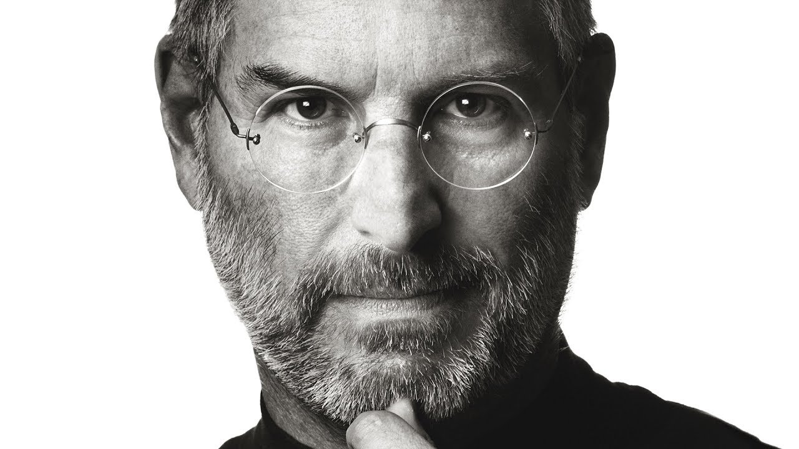

# 我崇拜的管理者：史蒂夫·乔布斯

## 一、初识与崇拜的起点

说起我崇拜的管理者，那一定是史蒂夫·乔布斯（Steve Jobs）。说实话，我最开始知道他，还是因为用的iPhone。当时我就好奇，是什么样的人能做出这么好看的产品？后来深入了解后发现，他不仅仅是一个CEO，更是一个极致的产品主义者和管理大师。

## 二、生平简介

乔布斯1955年出生在美国旧金山，一出生就被送给了养父母抚养。他从小就对电子设备感兴趣，1976年，年仅21岁的他和好友沃兹尼亚克在车库创立了苹果公司。

1985年，由于和董事会的矛盾，乔布斯被迫离开了自己创立的公司。那段时间苹果江河日下，差点倒闭。1997年，濒临破产的苹果请回了乔布斯，这成了苹果历史上最重要的转折点。

回归后的乔布斯用一系列革命性产品拯救了苹果：iPod革新了音乐产业，iPhone重新定义了手机，iPad开创了平板电脑时代。2011年，乔布斯因病去世，享年56岁。至今，苹果官网仍然保留着一个角落 [纪念这位伟人](https://www.apple.com/stevejobs/)，他的管理哲学至今仍在影响全球无数创业者。

## 三、主要管理方法

### 1. 专注力法则

乔布斯重返苹果时，公司有无数条产品线，乱得像一团麻。他直接砍到只剩10个产品，用他的话说："创新就是对1000个好点子说不。"这点对我启发特别大。

我之前做插件的时候，总是想着功能越多越好，什么都想加。结果代码越写越乱，bug一堆。后来我学乔布斯，每次只专注做一个核心功能，把一个功能做到极致再开发下一个。效率反而提高了不少。

### 2. DRI制度（直接责任人）

乔布斯在苹果推行了一个叫DRI的制度——每一件事都必须有一个明确的直接负责人。他不能容忍责任不清的情况发生。

我做项目的时候也用过这个方法。之前我们团队开发一个插件，任务分配下去，大家都说在做，但没人知道具体谁负责什么。后来我学乔布斯，每一项任务都指定一个DRI，谁负责谁担责，进度立刻清晰多了。

### 3. A级人才理论

乔布斯曾说："A级人才会招A级人才，B级人才只会招C级人才。"他坚持只招最优秀的人，认为和聪明人一起工作是最好的享受。

这点我深有体会。去年我们团队招人，面了好几个，其中有一个技术一般但特别能说会道。刚开始我想反正便宜，试试呗。结果他带来的代码质量很差，后来还拉低了整个团队的水平。乔布斯说得对，平庸真的会传染。

### 4. 现实扭曲力场

乔布斯有一个著名的"现实扭曲力场"（Reality Distortion Field）。他会给工程师设定在当时看来根本不可能完成的目标，逼迫团队突破极限。

我刚开始做插件开发的时候，总觉得自己这也不会那也不会。后来想想乔布斯的方法，管它呢，先把目标定高点再说。写着写着发现，那些我以为不可能的功能，最后都实现了。真是逼自己一把才知道有多大潜力。

## 四、对我的启示

说了这么多乔布斯的管理方法，最后谈谈他对我在开发工作上的具体启示吧。

我现在主要在做一些插件开发，比如onebot-info-image这类图片处理相关的插件。乔布斯让我明白几个道理：

**第一，少即是多。** 插件不要想着包罗万象，把一个核心功能做到极致，用户自然会买单。我现在做插件就坚持"一个插件只做一件事，但是把这件事做到最好"的原则。

**第二，注重用户体验。** 乔布斯对产品细节的极致追求让我意识到，做插件不能只管功能能用不管好不好用。每次发布新版本，我都会问自己：这个交互够不够流畅？界面够不够美观？

**第三，保持热爱。** 乔布斯之所以能做出那么多革命性产品，根本原因是他是真的热爱产品。我们做开发也是一样的，如果只是为了完成任务而写代码，那写出来的东西自己都不愿意用。

总的来说，乔布斯虽然走了，但他的管理哲学和方法论依然值得我们学习。他的专注力、DRI制度、A级人才理论，还有那种逼自己突破极限的精神，都在潜移默化地影响着我的开发工作。我相信，只要把这些理念真正落实到日常工作中，不管做什么产品，都一定能做出点名堂。

---
*全文约1200字*
