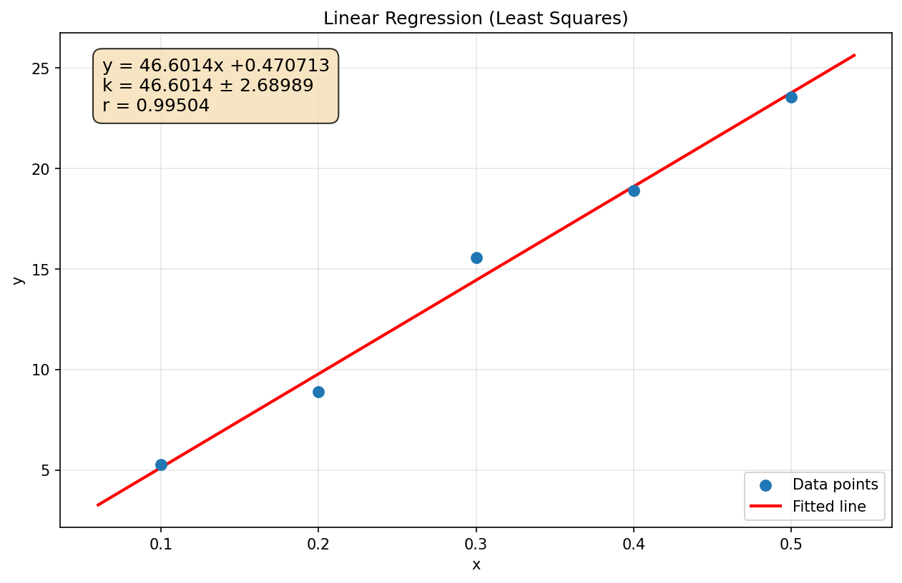

# 最小二乘法线性回归计算过程

计算时间：2026-05-08 00:43:27

## 原始数据

| i | $x$ | $y$ |
|---|---|---|
| 1 | 0.1 | 5.26857 |
| 2 | 0.2 | 8.91 |
| 3 | 0.3 | 15.59 |
| 4 | 0.4 | 18.92571 |
| 5 | 0.5 | 23.56143 |

## 统计量

- 样本数 $n = 5$
- $\sum x = 1.5$
- $\sum y = 72.2557$
- $\sum x^2 = 0.55$
- $\sum y^2 = 1263.52$
- $\sum xy = 26.3369$

## 平均值

$\bar{x} = \dfrac{\sum x}{n} = \dfrac{1.5}{5} = 0.3$
$\bar{y} = \dfrac{\sum y}{n} = \dfrac{72.2557}{5} = 14.4511$
$\overline{xy} = \dfrac{\sum xy}{n} = \dfrac{26.3369}{5} = 5.26737$
$\overline{x^2} = \dfrac{\sum x^2}{n} = \dfrac{0.55}{5} = 0.11$
$\overline{y^2} = \dfrac{\sum y^2}{n} = \dfrac{1263.52}{5} = 252.704$

## 斜率 $k$

$k = \dfrac{n\sum xy - \sum x \sum y}{n\sum x^2 - (\sum x)^2}$

$k = \dfrac{5 \times 26.3369 - 1.5 \times 72.2557}{5 \times 0.55 - (1.5)^2}$

$k = 46.6014$

## 截距 $b$

$b = \dfrac{\sum y - k\sum x}{n}$

$b = \dfrac{72.2557 - 46.6014 \times 1.5}{5}$

$b = 0.470713$

## 相关系数 $r$

$r = \dfrac{n\sum xy - \sum x \sum y}{\sqrt{[n\sum x^2 - (\sum x)^2][n\sum y^2 - (\sum y)^2]}}$

$r = \dfrac{5 \times 26.3369 - 1.5 \times 72.2557}{\sqrt{(5 \times 0.55 - 1.5^2)(5 \times 1263.52 - 72.2557^2)}}$

$r = 0.99504$

## 残差与剩余标准差 $S_y$

残差：$\varepsilon_i = y_i - (k x_i + b)$

| $i$ | $x_i$ | $y_i$ | $kx_i + b$ | $\varepsilon_i$ | $\varepsilon_i^2$ |
|---|---|---|---|---|---|
| 1 | 0.1 | 5.26857 | 5.13086 | 0.137714 | 0.0189651 |
| 2 | 0.2 | 8.91 | 9.791 | -0.880999 | 0.776159 |
| 3 | 0.3 | 15.59 | 14.4511 | 1.13886 | 1.297 |
| 4 | 0.4 | 18.9257 | 19.1113 | -0.185575 | 0.0344381 |
| 5 | 0.5 | 23.5614 | 23.7714 | -0.209998 | 0.0440992 |

$\mathrm{RSS} = \sum \varepsilon_i^2 = 2.17066$

$S_y = \sqrt{\dfrac{\mathrm{RSS}}{n-2}} = \sqrt{\dfrac{2.17066}{3}} = 0.850619$

## 斜率不确定度 $u_k$

$$u_k = \sqrt{\frac{1}{n(\overline{x^2} - \bar{x}^2)}} \; S_y$$

$\overline{x^2} - \bar{x}^2 = 0.11 - (0.3)^2 = 0.02$

$u_k = \sqrt{\dfrac{1}{5 \times 0.02}} \times 0.850619$

$u_k = 2.68989$

## 回归方程

$y = (46.6014 \pm 2.68989)x + (0.470713)$

## 拟合图

