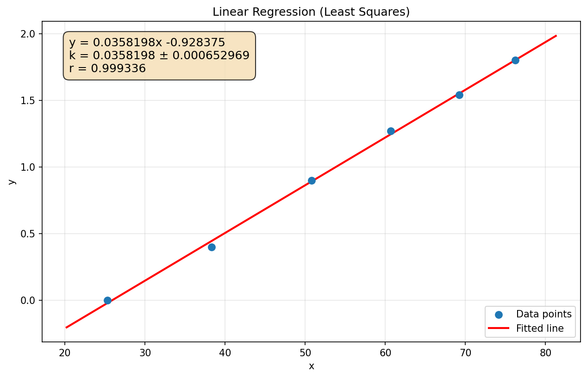

# 最小二乘法线性回归计算过程

计算时间：2026-05-24 15:48:01

## 原始数据

| i | $x$ | $y$ |
|---|---|---|
| 1 | 25.3 | 0.0 |
| 2 | 38.3 | 0.4 |
| 3 | 50.8 | 0.9 |
| 4 | 60.7 | 1.27 |
| 5 | 69.2 | 1.54 |
| 6 | 76.2 | 1.8 |

## 统计量

- 样本数 $n = 6$
- $\sum x = 320.5$
- $\sum y = 5.91$
- $\sum x^2 = 18967.2$
- $\sum y^2 = 8.1945$
- $\sum xy = 381.857$

## 平均值

$\bar{x} = \dfrac{\sum x}{n} = \dfrac{320.5}{6} = 53.4167$
$\bar{y} = \dfrac{\sum y}{n} = \dfrac{5.91}{6} = 0.985$
$\overline{xy} = \dfrac{\sum xy}{n} = \dfrac{381.857}{6} = 63.6428$
$\overline{x^2} = \dfrac{\sum x^2}{n} = \dfrac{18967.2}{6} = 3161.2$
$\overline{y^2} = \dfrac{\sum y^2}{n} = \dfrac{8.1945}{6} = 1.36575$

## 斜率 $k$

$k = \dfrac{n\sum xy - \sum x \sum y}{n\sum x^2 - (\sum x)^2}$

$k = \dfrac{6 \times 381.857 - 320.5 \times 5.91}{6 \times 18967.2 - (320.5)^2}$

$k = 0.0358198$

## 截距 $b$

$b = \dfrac{\sum y - k\sum x}{n}$

$b = \dfrac{5.91 - 0.0358198 \times 320.5}{6}$

$b = -0.928375$

## 相关系数 $r$

$r = \dfrac{n\sum xy - \sum x \sum y}{\sqrt{[n\sum x^2 - (\sum x)^2][n\sum y^2 - (\sum y)^2]}}$

$r = \dfrac{6 \times 381.857 - 320.5 \times 5.91}{\sqrt{(6 \times 18967.2 - 320.5^2)(6 \times 8.1945 - 5.91^2)}}$

$r = 0.999336$

## 残差与剩余标准差 $S_y$

残差：$\varepsilon_i = y_i - (k x_i + b)$

| $i$ | $x_i$ | $y_i$ | $kx_i + b$ | $\varepsilon_i$ | $\varepsilon_i^2$ |
|---|---|---|---|---|---|
| 1 | 25.3 | 0 | -0.0221336 | 0.0221336 | 0.000489897 |
| 2 | 38.3 | 0.4 | 0.443524 | -0.0435239 | 0.00189433 |
| 3 | 50.8 | 0.9 | 0.891272 | 0.0087285 | 7.61867e-05 |
| 4 | 60.7 | 1.27 | 1.24589 | 0.0241124 | 0.000581407 |
| 5 | 69.2 | 1.54 | 1.55036 | -0.010356 | 0.000107246 |
| 6 | 76.2 | 1.8 | 1.80109 | -0.00109464 | 1.19824e-06 |

$\mathrm{RSS} = \sum \varepsilon_i^2 = 0.00315027$

$S_y = \sqrt{\dfrac{\mathrm{RSS}}{n-2}} = \sqrt{\dfrac{0.00315027}{4}} = 0.0280636$

## 斜率不确定度 $u_k$

$$u_k = \sqrt{\frac{1}{n(\overline{x^2} - \bar{x}^2)}} \; S_y$$

$\overline{x^2} - \bar{x}^2 = 3161.2 - (53.4167)^2 = 307.858$

$u_k = \sqrt{\dfrac{1}{6 \times 307.858}} \times 0.0280636$

$u_k = 0.000652969$

## 回归方程

$y = (0.0358198 \pm 0.000652969)x + (-0.928375)$

## 拟合图

