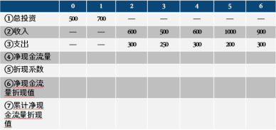
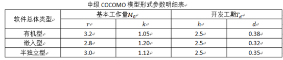
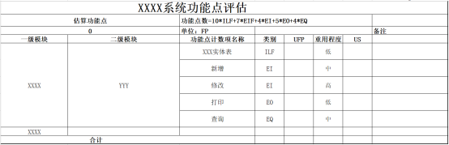
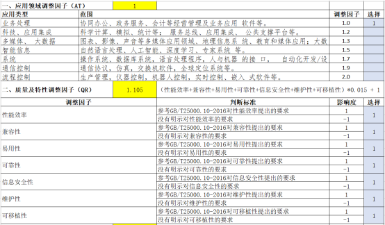
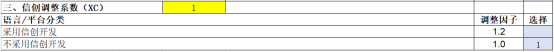
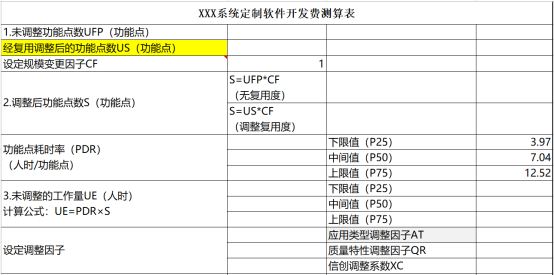
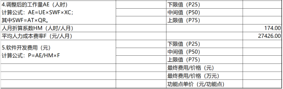

## problem 1
1.某IT企业计划投资某信息系统项目，该项目在前3年初分别投资280万元、180万元和250万元；预计第3年至第9年获得收益，其中每年的营业收入为350万元，经营成本预计为80万元。投资者希望能通过投资该项目能达到20%的毛利率（即不考虑税收），试问该企业如何决策是否投资该信息系统项目？（要求绘制现金流量图）

## problem 2
2.某新建项目，建设期3年，分年均衡贷款，第一年贷款600万元，第二年800万元，第三年500万元，年利率为10％。假定各种债务资金均在年中支用，即当年借款支用额按半年计息，上年借款按全年计息，计算建设期贷款利息。

## problem 3
3.ABC公司购买了一套存储设备，购买价格为400000元，预计其使用寿命为5年，预计其残值为6%。请用双倍余额递减法计算每年的折旧额。

## problem 4
4.某项目的投资及净现金收入如下，ic=10%，求该项目的动态投资回收期。

## problem 5
5.某半独立型软件项目预计30kLOC的代码量，根据软件需求及开发投入情况，基于COCOMO模型，该软件项目的综合影响因子U为1.22，假设工时费用率a每人月20000元，请估算该项目的工作量、工期和成本。

## problem 6
6.请利用基于功能点的评估方法计算软件系统的开发费用，表格如下：

