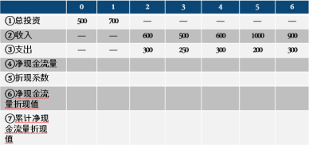
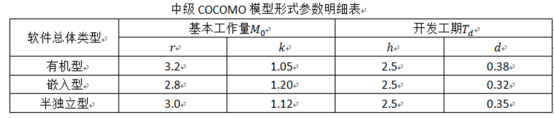
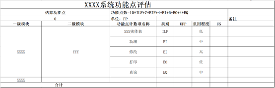
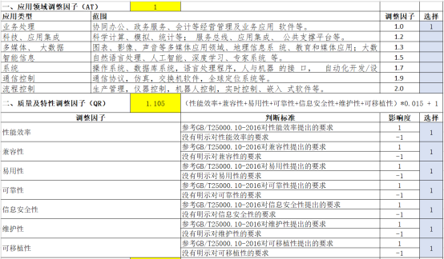
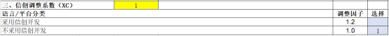
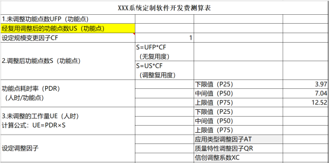
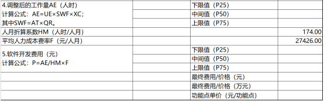

## problem 1
1.某IT企业计划投资某信息系统项目，该项目在前3年初分别投资280万元、180万元和250万元；预计第3年至第9年获得收益，其中每年的营业收入为350万元，经营成本预计为80万元。投资者希望能通过投资该项目能达到20%的毛利率（即不考虑税收），试问该企业如何决策是否投资该信息系统项目？（要求绘制现金流量图）

## problem 2
2.某新建项目，建设期3年，分年均衡贷款，第一年贷款600万元，第二年800万元，第三年500万元，年利率为10％。假定各种债务资金均在年中支用，即当年借款支用额按半年计息，上年借款按全年计息，计算建设期贷款利息。

## problem 3
3.ABC公司购买了一套存储设备，购买价格为400000元，预计其使用寿命为5年，预计其残值为6%。请用双倍余额递减法计算每年的折旧额。

## problem 4
4.某项目的投资及净现金收入如下，ic=10%，求该项目的动态投资回收期。


## problem 5
5.某半独立型软件项目预计30kLOC的代码量，根据软件需求及开发投入情况，基于COCOMO模型，该软件项目的综合影响因子U为1.22，假设工时费用率a每人月20000元，请估算该项目的工作量、工期和成本。


## problem 6
6.请利用基于功能点的评估方法计算软件系统的开发费用，表格如下：






### image6.1的自然语言描述：
```
估算功能点,功能点数 = 10∗ILF+7∗EIF+4∗EI+5∗EO+4∗EQ,,,,,
0,单位：FP,,,,,备注
一级模块,二级模块,功能点计数项名称,类别,UFP,重用程度,US
XXXX,YYY,XXX实体表,ILF,,低,
,,新增,EI,,中,
,,修改,EI,,高,
,,打印,EO,,低,
,,查询,EQ,,中,
XXXX,,,,,,
,合计,,,,,
```

```
XXXX系统功能点评估信息汇总

    1. 评估基本信息

        项目名称：XXXX系统功能点评估

        估算功能点总数：0

        计算公式：功能点数 = 10×ILF+7×EIF+4×EI+5×EO+4×EQ

        计量单位：FP

    2. 功能点明细（模块：XXXX / YYY）

        数据项 1：XXX实体表；类别：ILF；重用程度：低

        数据项 2：新增；类别：EI；重用程度：中

        数据项 3：修改；类别：EI；重用程度：高

        数据项 4：打印；类别：EO；重用程度：低

        数据项 5：查询；类别：EQ；重用程度：中

    3. 其他项

        额外模块占位：XXXX

        统计栏：合计

        表头包含字段：一级模块、二级模块、功能点计数项名称、类别、UFP、重用程度、US、备注
```
### image6.2的自然语言描述:
```
表格 2：调整因子评估表
一、应用领域调整因子 (AT)

当前值：1
应用类型	范围	调整因子	选择
业务处理	协同办公、政务服务、会计等经营管理及业务应用软件等。	1.0	1
科技、应用集成	科学计算、模拟、统计等；服务总线、应用集成、公共支撑平台等。	1.2	
多媒体、大数据	图表、影像、声音等多媒体应用领域、地理信息系统、教育和媒体应用；大数据	1.3	
智能信息	自然语言处理、人工智能、深度学习、专家系统等。	1.5	
系统	操作系统、数据库系统、语言处理程序、人与机器的接口，自动化开发/设	1.7	
通信控制	通信协议、仿真、交换机软件、全球定位系统等。	1.9	
流程控制	生产管理、仪器控制、机器人控制、实时控制、嵌入式软件等。	2.0	
二、质量及特性调整因子 (QR)

当前值：1.105
公式：(性能效率+兼容性+易用性+可靠性+信息安全性+维护性+可移植性) * 0.015 + 1
调整因子	判断标准	影响度	选择
性能效率	参考GB/T25000.10-2016对性能效率提出的要求	1	1
	没有明示对性能效率的要求	-1	
兼容性	参考GB/T25000.10-2016对兼容性提出的要求	1	1
	没有明示对兼容性的要求	-1	
易用性	参考GB/T25000.10-2016对易用性提出的要求	1	1
	没有明示对易用性的要求	-1	
可靠性	参考GB/T25000.10-2016对可靠性提出的要求	1	1
	没有明示对可靠性的要求	-1	
信息安全性	参考GB/T25000.10-2016对信息安全性提出的要求	1	1
	没有明示对信息安全性的要求	-1	
维护性	参考GB/T25000.10-2016对维护性提出的要求	1	1
	没有明示对维护性的要求	-1	
可移植性	参考GB/T25000.10-2016对可移植性提出的要求	1	1
	没有明示对可移植性的要求	-1
```

```
软件开发成本估算调整因子明细

一、 应用领域调整因子（AT）

    当前选定值：1

    1. 业务处理：

        范围：协同办公、政务服务、会计等经营管理及业务应用软件等。

        调整因子：1.0

        选择：1（已选）

    2. 科技、应用集成：

        范围：科学计算、模拟、统计等；服务总线、应用集成、公共支撑平台等。

        调整因子：1.2

        选择：（未选）

    3. 多媒体、大数据：

        范围：图表、影像、声音等多媒体应用领域、地理信息系统、教育和媒体应用；大数据。

        调整因子：1.3

        选择：（未选）

    4. 智能信息：

        范围：自然语言处理、人工智能、深度学习、专家系统等。

        调整因子：1.5

        选择：（未选）

    5. 系统：

        范围：操作系统、数据库系统、语言处理程序、人与机器的接口、自动化开发/设备。

        调整因子：1.7

        选择：（未选）

    6. 通信控制：

        范围：通信协议、仿真、交换机软件、全球定位系统等。

        调整因子：1.9

        选择：（未选）

    7. 流程控制：

        范围：生产管理、仪器控制、机器人控制、实时控制、嵌入式软件等。

        调整因子：2.0

        选择：（未选）

二、 质量及特性调整因子（QR）

    当前计算结果：1.105

    计算公式：(性能效率 + 兼容性 + 易用性 + 可靠性 + 信息安全性 + 维护性 + 可移植性) * 0.015 + 1

    各维度判断标准与影响度：

        1. 性能效率：

            标准 A：参考GB/T25000.10-2016对性能效率提出的要求（影响度：1）

            标准 B：没有明示对性能效率的要求（影响度：-1）

            选择：1（已选标准 A）

        2. 兼容性：

            标准 A：参考GB/T25000.10-2016对兼容性提出的要求（影响度：1）

            标准 B：没有明示对兼容性的要求（影响度：-1）

            选择：1（已选标准 A）

        3. 易用性：

            标准 A：参考GB/T25000.10-2016对易用性提出的要求（影响度：1）

            标准 B：没有明示对易用性的要求（影响度：-1）

            选择：1（已选标准 A）

        4. 可靠性：

            标准 A：参考GB/T25000.10-2016对可靠性提出的要求（影响度：1）

            标准 B：没有明示对可靠性的要求（影响度：-1）

            选择：1（已选标准 A）

        5. 信息安全性：

            标准 A：参考GB/T25000.10-2016对信息安全性提出的要求（影响度：1）

            标准 B：没有明示对信息安全性的要求（影响度：-1）

            选择：1（已选标准 A）

        6. 维护性：

            标准 A：参考GB/T25000.10-2016对维护性提出的要求（影响度：1）

            标准 B：没有明示对维护性的要求（影响度：-1）

            选择：1（已选标准 A）

        7. 可移植性：

            标准 A：参考GB/T25000.10-2016对可移植性提出的要求（影响度：1）

            标准 B：没有明示对可移植性的要求（影响度：-1）

            选择：1（已选标准 A）
```

### image6.3的自然语言描述：
```
三、信创调整系数（XC）,1,,
语言/平台分类,,调整因子,选择
采用信创开发,,1.2,
不采用信创开发,,1.0,1
```

```
三、信创调整系数（XC）

    当前设定值：1

    明细分类：

        1. 采用信创开发

            调整因子：1.2

            选择情况：未选择

        2. 不采用信创开发

            调整因子：1.0

            选择情况：已选择（标记为 1）
```

### image6.4的自然语言描述
```
1. 表格形式（还原原始结构）
XXX 系统定制软件开发费测算表			
1. 未调整功能点数 UFP（功能点）			
经复用调整后的功能点数 US（功能点）			
设定规模变更因子 CF	1		
2. 调整后功能点数 S（功能点）	S=UFP∗CF (无复用度)		
	S=US∗CF (调整复用度)		
功能点耗时率（PDR）（人时/功能点）		下限值 (P25)	3.97
		中间值 (P50)	7.04
		上限值 (P75)	12.52
3. 未调整的工作量 UE（人时）计算公式：UE=PDR×S		下限值 (P25)	
		中间值 (P50)	
		上限值 (P75)	
设定调整因子		应用类型调整因子 AT	
		质量特性调整因子 QR	
		信创调整系数 XC
```
```
2. 分点形式（纯文字罗列）

XXX 系统定制软件开发费测算表

    1. 功能点规模定义

        未调整功能点数 UFP（功能点）

        经复用调整后的功能点数 US（功能点）：(此项在图中为黄色高亮)

        设定规模变更因子 CF：1

    2. 调整后功能点数 S（功能点）计算

        公式 1（无复用度）：S=UFP×CF

        公式 2（调整复用度）：S=US×CF

    3. 功能点耗时率 (PDR) —— 单位：人时/功能点

        下限值 (P25)：3.97

        中间值 (P50)：7.04

        上限值 (P75)：12.52

    4. 未调整的工作量 UE（人时）

        计算公式：UE=PDR×S

        统计项：包含下限值 (P25)、中间值 (P50)、上限值 (P75)

    5. 设定调整因子

        应用类型调整因子 AT

        质量特性调整因子 QR

        信创调整系数 XC
```


### image6.5的自然语言描述
```
项目名称 / 计算公式	子项 / 参数	数值

4. 调整后的工作量 AE (人时)

计算公式：AE=UE×SWF×XC;

其中 SWF=AT×QR
	下限值 (P25)	
	中间值 (P50)	
	上限值 (P75)	
人月折算系数 HM (人时/人月)		174.00
平均人力成本费率 F (元/人月)		27426.00

5. 软件开发费用 (元)

计算公式：P=AE/HM×F
	下限值 (P25)	
	中间值 (P50)	
	上限值 (P75)	
	最终费用/价格 (元)	
	最终费用/价格 (万元)	
	功能点单价 (元/功能点)
```
```
1. 调整后的工作量 AE (单位：人时)

    计算公式：AE=UE×SWF×XC

    辅助公式：SWF=AT×QR

    统计维度：包含下限值 (P25)、中间值 (P50)、上限值 (P75)

2. 成本折算参数

    人月折算系数 HM：174.00 (人时/人月)

    平均人力成本费率 F：27426.00 (元/人月)

3. 软件开发费用 (单位：元)

    计算公式：P=AE/HM×F

    统计维度：包含下限值 (P25)、中间值 (P50)、上限值 (P75)

4. 最终结算指标

    最终费用/价格 (元)

    最终费用/价格 (万元)

    功能点单价 (元/功能点)
```