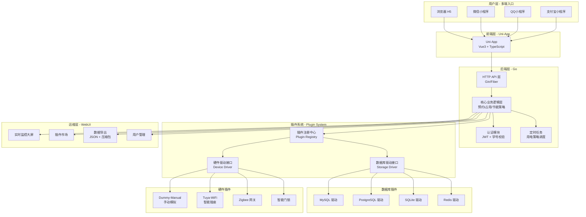
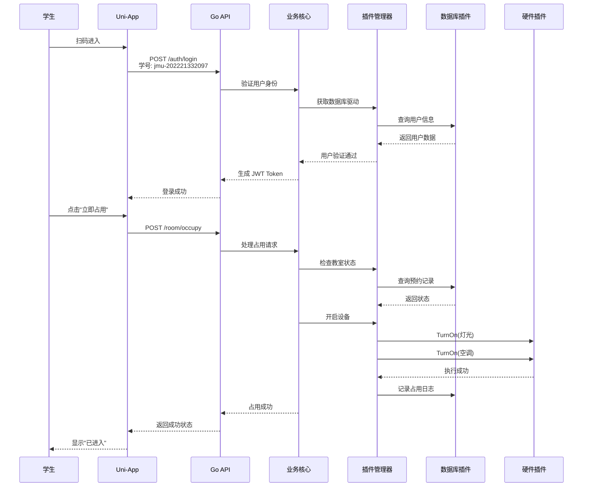
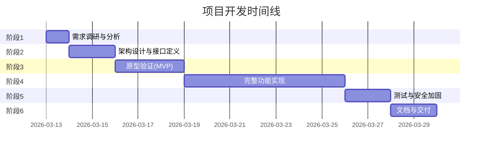

# 24小时智慧无人管理自助实习教室系统设计方案

## 一、项目背景与目标

### 1.1 项目背景

随着高校信息化建设的推进，学生对课后自主学习空间的需求日益增长。传统的教室管理模式存在以下痛点：

- **开放时间受限**：教室仅在上课时间开放，课后资源闲置
- **管理成本高**：需要专人值守，人力成本大
- **使用不便**：借用流程繁琐，学生体验差
- **能源浪费**：无人时设备常开，缺乏节能机制
- **安全隐患**：无法有效监控违规使用行为

### 1.2 项目目标

建设一套**「零嵌入式、纯 Web+小程序、插件化、可热插拔」**的 24h 智慧自助实习教室管理系统，实现：

- ✅ **学生一键预约/入驻**：扫码即用，零门槛
- ✅ **后台自动节能**：无人自动断电，有人自动恢复
- ✅ **安全防违规**：超时提醒、信用分机制、黑名单
- ✅ **后期硬件升级零重构**：插件化架构，设备无缝替换

---

## 二、核心设计原则

### 2.1 零硬件维护

教室门口**只放一块普通屏幕 + 二维码 + URL**，不放任何树莓派/单片机。

| 传统方案 | 本方案 |
|---------|--------|
| 嵌入式终端（易故障） | 纯软件方案（易维护） |
| 现场运维成本高 | 远程管理即可 |
| 硬件依赖强 | 硬件无关，随时迁移 |

### 2.2 极致可扩展

所有外部依赖（数据库、硬件设备）**全部插件化**，像 [Koishi](https://github.com/koishijs/koishi) 一样「写一个插件 = 接入一个新东西」。

### 2.3 统一抽象 + 双语言插件

- **业务层**：Go（高并发处理）
- **插件层**：支持 Go（性能）+ JavaScript/TS（迭代快）
- **参考模式**：Koishi + Satori 的 Adapter 模式

### 2.4 学生零负担

微信扫码 → 自动识别「学校简称+学号」（如 `jmu-202221332097`）作为唯一 ID，即可预约/占用。

### 2.5 节能闭环

```
教室空闲 → 插件自动关灯/空调
    ↓
有人扫码 → 自动开灯/预开空调
    ↓
超时未离开 → 提醒 → 强制断电
```

---

## 三、系统架构设计

### 3.1 整体架构图



### 3.2 插件调用流程



---

## 四、技术栈选型

### 4.1 前端

| 技术 | 选择 | 理由 |
|-----|------|------|
| 框架 | Uni-App (Vue3) | 一套代码输出 H5 + 微信/QQ/支付宝小程序 |
| 语言 | TypeScript | 类型安全，开发体验好 |
| UI | uView / uni-ui | 组件丰富，适配多端 |

### 4.2 后端

| 技术 | 选择 | 理由 |
|-----|------|------|
| 语言 | Go | 高并发处理，原生支持插件 |
| Web框架 | Gin / Fiber | 高性能，生态成熟 |
| 插件机制 | Go Plugin / 自研 Registry | 支持动态加载 |

### 4.3 数据库抽象层

```go
// 统一数据库驱动接口
interface StorageDriver {
    // 基础 CRUD
    Get(ctx context.Context, key string) (interface{}, error)
    Set(ctx context.Context, key string, value interface{}) error
    Delete(ctx context.Context, key string) error
    Query(ctx context.Context, query QuerySpec) ([]interface{}, error)
    
    // 数据迁移（核心功能）
    Export(ctx context.Context) ([]ExportRecord, error)
    Import(ctx context.Context, records []ExportRecord) error
}
```

**支持的数据库**：
- MySQL（生产环境）
- PostgreSQL（企业级）
- SQLite（开发/轻量部署）
- Redis（缓存/会话）

### 4.4 硬件抽象层

```go
// 统一硬件驱动接口
interface DeviceDriver {
    // 设备元信息
    DeviceType() string
    DeviceName() string
    
    // 状态管理
    GetStatus(ctx context.Context) (DeviceStatus, error)
    
    // 控制指令
    Execute(ctx context.Context, cmd Command) error
    TurnOn() error
    TurnOff() error
    
    // 事件监听
    OnStatusChange(callback func(Event))
}
```

**支持的设备**：
- 灯光控制器
- 空调控制器
- 门锁控制器
- 人体感应器（可选）

---

## 五、核心功能模块

### 5.1 学生端（Uni-App）

| 功能 | 描述 |
|-----|------|
| 扫码进入 | 教室门口二维码 → 自动跳转小程序 |
| 身份认证 | 输入学号 `jmu-xxxx` 或自动识别 |
| 状态查看 | 实时显示教室空闲/占用/剩余时间 |
| 预约时段 | 选择未来时间段预约 |
| 立即占用 | 扫码即开，即时使用 |
| 结束使用 | 一键离开，自动结算 |
| 违规提醒 | 超时提醒，信用分变动通知 |

### 5.2 运维端（Go WebUI）

| 功能 | 描述 |
|-----|------|
| 插件市场 | 可视化安装/卸载/配置插件 |
| 实时监控 | 教室状态、设备状态、在线人数 |
| 数据导出 | 一键导出 JSON + 压缩包，跨数据库迁移 |
| 用户管理 | 信用分查看、黑名单管理 |
| 节能策略 | 配置自动断电时间、温度阈值 |
| 审计日志 | 完整操作记录，支持追溯 |

### 5.3 后端核心服务

```
┌─────────────────────────────────────────┐
│           业务服务层 (Business)          │
├─────────────────────────────────────────┤
│  ReservationService    预约管理服务      │
│  OccupancyService      占用管理服务      │
│  EnergyService         节能策略服务      │
│  AuthService           认证授权服务      │
│  CreditService         信用分服务        │
│  AuditService          审计日志服务      │
└─────────────────────────────────────────┘
                    ↓
┌─────────────────────────────────────────┐
│           插件抽象层 (Plugin)            │
├─────────────────────────────────────────┤
│  StorageManager        数据库管理器      │
│  DeviceManager         设备管理器        │
│  PluginRegistry        插件注册中心      │
└─────────────────────────────────────────┘
```

---

## 六、关键创新点

### 6.1 学号即唯一ID

```
格式: {学校简称}-{入学年份}{学院}{专业}{班级}{序号}
示例: jmu-202221332097
      │   │   │││ │││└─ 序号 97
      │   │   │││ ││└── 班级 3
      │   │   │││ │└─── 专业 32
      │   │   ││└─┴──── 学院 13
      │   │   └┴─────── 入学年份 2022
      │   └──────────── 学校简称 jmu (集美大学)
      └──────────────── 分隔符 -
```

**优势**：
- 自带学校标识，支持多校扩展
- 包含年级信息，方便权限管理
- 无需额外注册，学号即账号

### 6.2 统一数据导出格式

```json
{
  "export_version": "1.0",
  "export_time": "2025-03-20T10:30:00Z",
  "school_code": "jmu",
  "data": {
    "users": [
      {"id": "jmu-202221332097", "name": "张三", "created_at": "..."}
    ],
    "rooms": [
      {"id": "room-101", "name": "智慧教室101", "capacity": 30}
    ],
    "reservations": [
      {"id": "res-001", "user_id": "jmu-202221332097", "room_id": "room-101", "start": "...", "end": "..."}
    ],
    "usage_logs": [...]
  }
}
```

**价值**：
- 与具体数据库无关，方便迁移
- 支持备份恢复
- 便于数据分析和报表生成

### 6.3 硬件渐进式接入

| 阶段 | 硬件配置 | 插件方案 |
|-----|---------|---------|
| 第一阶段 | 无智能设备 | `dummy-manual` 插件（模拟手动开关） |
| 第二阶段 | 智能插座/网关 | `tuya-wifi` 插件 |
| 第三阶段 | 智能门锁/传感器 | `zigbee` 插件 |

**核心优势**：业务层代码完全不变，仅需更换插件！

---

## 七、开发过程与时间规划

### 7.1 六阶段开发计划



### 7.2 各阶段详细说明

| 阶段 | 名称 | 周期 | 主要产出 |
|-----|------|------|---------|
| 1 | 需求调研 | 1天 | 需求文档、用户故事（学生/运维） |
| 2 | 架构设计 | 2天 | 架构图、接口定义（Storage/Driver）、技术选型 |
| 3 | 原型验证 | 3天 | Go + SQLite + Uni-App MVP、验证插件热插拔 |
| 4 | 完整实现 | 7天 | 多数据库插件、硬件插件、完整业务流程 |
| 5 | 测试安全 | 2天 | 并发测试、安全加固、压力测试 |
| 6 | 交付文档 | 2天 | GitHub仓库、部署脚本、插件开发手册 |

---

## 八、项目结构

```
smart-classroom/
├── backend/                    # Go 后端
│   ├── cmd/
│   │   ├── server/            # 主服务入口
│   │   └── admin/             # 运维CLI工具
│   ├── internal/
│   │   ├── core/              # 核心业务逻辑
│   │   ├── api/               # HTTP API 路由
│   │   ├── auth/              # 认证模块
│   │   └── scheduler/         # 定时任务
│   ├── pkg/
│   │   ├── plugin/            # 插件系统框架
│   │   ├── database/          # 数据库驱动接口
│   │   └── hardware/          # 硬件驱动接口
│   ├── plugins/               # 内置插件
│   │   ├── database/
│   │   │   ├── mysql/
│   │   │   ├── postgres/
│   │   │   ├── sqlite/
│   │   │   └── redis/
│   │   └── hardware/
│   │       ├── dummy/
│   │       ├── tuya/
│   │       └── zigbee/
│   └── webui/                 # 内置运维WebUI
├── frontend/                   # uni-app 前端
│   ├── src/
│   │   ├── pages/
│   │   │   ├── index/         # 扫码入口
│   │   │   ├── auth/          # 认证页
│   │   │   ├── booking/       # 预约流程
│   │   │   └── status/        # 状态查询
│   │   └── utils/
│   └── manifest.json
└── docs/                       # 文档
    ├── api.md
    ├── plugin-dev.md
    └── deploy.md
```

---

## 九、可扩展性与未来演进

### 9.1 横向扩展

```
智慧教室平台
    ├── 自习室预约系统
    ├── 实验室管理系统
    ├── 会议室预约系统
    └── 共享空间管理平台
```

### 9.2 纵向深化

| 方向 | 功能 |
|-----|------|
| AI 智能化 | 使用习惯分析、智能推荐时段 |
| IoT 生态 | 接入更多智能设备（窗帘、投影仪等） |
| 数据可视化 | 使用报表、能耗分析、预测模型 |
| 多校联盟 | 跨校资源共享、学分互认 |

---

## 十、个人技术储备与实现保障

### 10.1 相关项目经验

本人在 GitHub 维护多个开源项目，具备相关技术栈的实战经验：

| 项目 | 技术栈 | 相关性 |
|-----|--------|--------|
| [Winload](https://github.com/VincentZyuApps) | Rust/Python | 系统级开发经验 |
| Koishi 插件生态 | TypeScript | 插件化架构深度实践 |
| Uni-App 项目 | Vue3/TS | 多端开发经验 |
| Go 后端服务 | Go/Gin | 高并发服务开发 |

### 10.2 参考架构

本系统在架构设计上深度参考了以下优秀开源项目：

- **[Koishi](https://github.com/koishijs/koishi)**：插件生命周期管理、热重载机制、上下文注入
- **[Satori](https://github.com/satorijs/satori)**：跨平台抽象层设计、统一协议定义
- **[WebUI](https://github.com/koishijs/webui)**：控制台与核心分离、配置可视化

---

## 十一、总结

### 11.1 设计优势

| 优势 | 说明 |
|-----|------|
| 🎯 **简单易用** | 扫码即用，无需下载APP |
| 💰 **成本低廉** | 零嵌入式设备，纯软件方案 |
| 🔌 **高扩展性** | 插件机制，随时接入新设备 |
| 🛠️ **易维护** | 模块解耦，远程管理 |
| 🚀 **可持续升级** | 硬件渐进接入，业务代码零改动 |

### 11.2 核心价值

> **"软件先行，硬件后补"** —— 通过插件化架构，实现业务逻辑与底层实现的完全解耦。

学校可以在**零硬件投入**的情况下先上线系统，后期根据经费情况逐步添加智能设备，整个过程**无需修改任何业务代码**，仅需安装对应插件即可。

### 11.3 结语

本方案不仅是一个教室预约系统，更是一个**可扩展的智慧空间管理平台**。其插件化架构设计参考了业界优秀的开源实践（Koishi/Satori），具备良好的长期可维护性和快速迭代能力。

**本人已基于 Go + Uni-App + 插件化理念完成核心原型设计，随时可演示。**

---

*作者：VincentZyu*  
*日期：2026-03-20*
