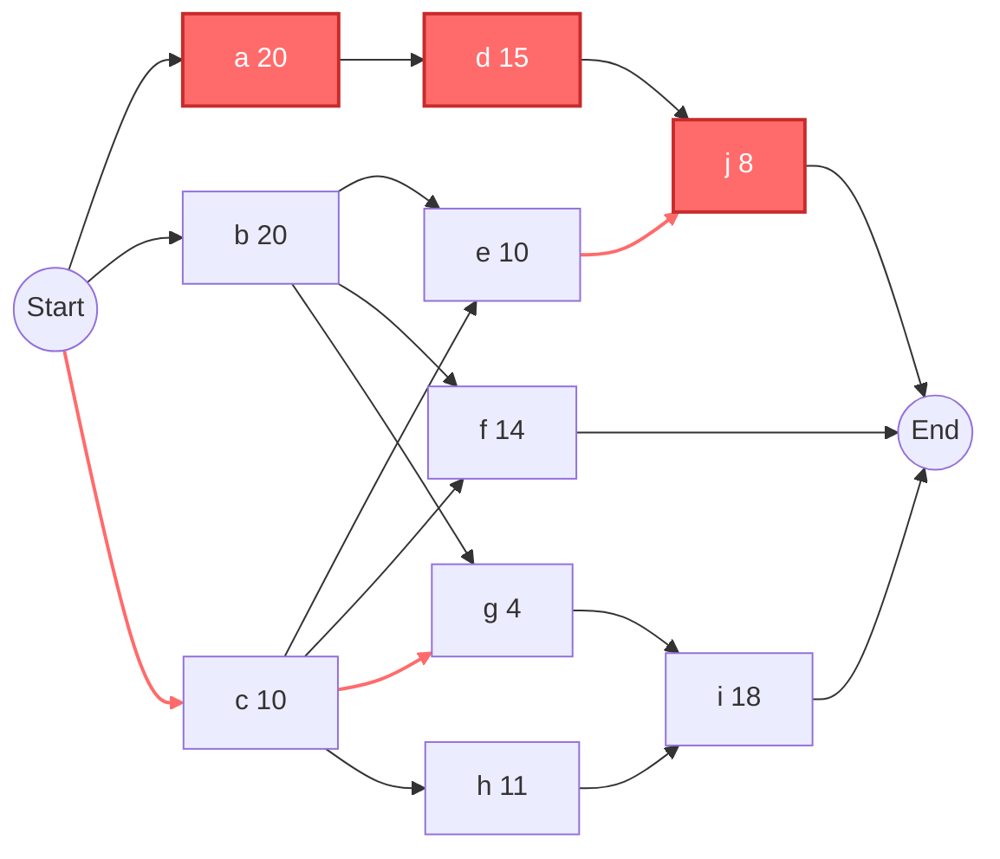

# 作业六：关键路径分析（PERT + 前导图法）

## 一、PERT 期望工期计算

| 活动 | 乐观 (O) | 最可能 (M) | 悲观 (P) | 公式 (O+4M+P)/6 | 期望工期 |
|:---:|:--------:|:----------:|:--------:|:---------------:|:--------:|
| a | 10 | 22 | 22 | (10+88+22)/6 | **20** |
| b | 20 | 20 | 20 | (20+80+20)/6 | **20** |
| c | 4 | 10 | 16 | (4+40+16)/6 | **10** |
| d | 2 | 14 | 32 | (2+56+32)/6 | **15** |
| e | 8 | 8 | 20 | (8+32+20)/6 | **10** |
| f | 8 | 14 | 20 | (8+56+20)/6 | **14** |
| g | 4 | 4 | 4 | (4+16+4)/6 | **4** |
| h | 2 | 12 | 16 | (2+48+16)/6 | **11** |
| i | 6 | 16 | 38 | (6+64+38)/6 | **18** |
| j | 2 | 8 | 14 | (2+32+14)/6 | **8** |

## 二、前导图（活动网络图）

### 节点依赖关系

```
        ┌──── a(20) ────┐
        │               ▼
        │               d(15) ──┐
        │                       ▼
Start ──┼──── b(20) ──┬──── e(10) ──► j(8) ──► End
        │             ├──── f(14) ──► End
        │             ├──── g(4) ───┐
        │             │             ▼
        └──── c(10) ──┘             i(18) ──► End
                      │
                      └──── h(11) ──┘
```

### Mermaid 网络图



### 前导关系表

| 活动 | 期望工期 | 紧前活动 |
|:---:|:--------:|:--------:|
| a | 20 | 无 |
| b | 20 | 无 |
| c | 10 | 无 |
| d | 15 | a |
| e | 10 | b, c |
| f | 14 | b, c |
| g | 4 | b, c |
| h | 11 | c |
| i | 18 | g, h |
| j | 8 | d, e |

## 三、关键路径计算

### 正推法（求 ES, EF）

| 活动 | 工期 | 紧前 | ES | EF |
|:---:|:----:|:----:|:--:|:--:|
| a | 20 | 无 | 0 | 20 |
| b | 20 | 无 | 0 | 20 |
| c | 10 | 无 | 0 | 10 |
| d | 15 | a | 20 | 35 |
| e | 10 | b,c | max(20,10)=20 | 30 |
| f | 14 | b,c | max(20,10)=20 | 34 |
| g | 4 | b,c | max(20,10)=20 | 24 |
| h | 11 | c | 10 | 21 |
| i | 18 | g,h | max(24,21)=24 | 42 |
| j | 8 | d,e | max(35,30)=35 | **43** |

**项目最早完工时间 = max(EF₍ =34, EFᵢ=42, EFₙ=43) = 43**

### 逆推法（求 LF, LS）

| 活动 | 工期 | 后续 | LF | LS |
|:---:|:----:|:----:|:--:|:--:|
| j | 8 | 无 | 43 | 35 |
| i | 18 | 无 | 43 | 25 |
| f | 14 | 无 | 43 | 29 |
| e | 10 | j | 35 | 25 |
| d | 15 | j | 35 | 20 |
| g | 4 | i | 25 | 21 |
| h | 11 | i | 25 | 14 |
| a | 20 | d | 20 | 0 |
| b | 20 | e,f,g | min(25,29,21)=21 | 1 |
| c | 10 | e,f,g,h | min(25,29,21,14)=14 | 4 |

### 总时差（Slack = LS - ES）

| 活动 | ES | LS | Slack | 关键路径? |
|:---:|:--:|:--:|:-----:|:---------:|
| a | 0 | 0 | **0** | ✅ |
| b | 0 | 1 | 1 | |
| c | 0 | 4 | 4 | |
| d | 20 | 20 | **0** | ✅ |
| e | 20 | 25 | 5 | |
| f | 20 | 29 | 9 | |
| g | 20 | 21 | 1 | |
| h | 10 | 14 | 4 | |
| i | 24 | 25 | 1 | |
| j | 35 | 35 | **0** | ✅ |

## 四、结论

**关键路径：a → d → j**

**项目最早完工时间：43 个时间单位**

**路径总工期验算：** 20 (a) + 15 (d) + 8 (j) = **43**
